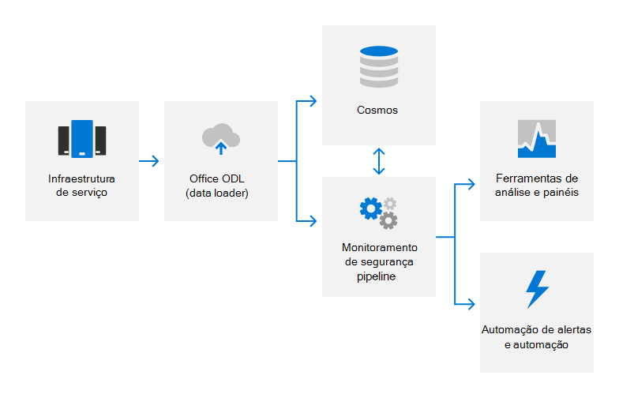

# Visão geral do registro de Auditoria

## Como o Microsoft 365 em log de auditoria?

Microsoft 365 emprega o log de auditoria para detectar atividades não autorizadas em seus produtos e serviços e fornecer responsabilidade para a equipe da Microsoft. Os logs de auditoria capturam detalhes sobre alterações de configuração do sistema e eventos de acesso, com detalhes para identificar quem foi responsável pela atividade, quando e onde a atividade ocorreu e qual foi o resultado da atividade. A análise de log automatizada dá suporte à detecção quase em tempo real de comportamento suspeito. Os possíveis incidentes são escalonados para Microsoft 365 equipe de Resposta de Segurança para investigação posterior.

Microsoft 365 log de auditoria interna captura dados de log de várias fontes, como:

- Logs de eventos
- Logs do AppLocker
- Dados de desempenho
- System Center dados
- Registros de detalhes de chamada
- Qualidade dos dados de experiência
- Logs do Servidor Web do IIS
- SQL Server logs
- Dados de syslog
- Logs de auditoria de segurança

## Como é Microsoft 365 centralizar e relatar logs de auditoria?

Muitos tipos diferentes de dados de log são carregados de servidores Microsoft 365 para uma solução de monitoramento de segurança proprietária para análise quase em tempo real (NRT) e um serviço interno de computação de dados grandes (Cosmos) para armazenamento a longo prazo. Essa transferência de dados ocorre por meio de uma conexão TLS validada pelo FIPS 140-2 em portas e protocolos aprovados usando uma ferramenta de automação proprietária chamada ODL (carregador de dados Office).

Os logs são processados no NRT usando métodos de aprendizado de máquina, estatísticas e baseados em regras para detectar indicadores de desempenho do sistema e possíveis eventos de segurança. Os modelos de aprendizado de máquina usam dados de log de entrada e dados de log históricos armazenados Cosmos melhorar continuamente os recursos de detecção. As detecções relacionadas à segurança geram alertas, notificando os engenheiros de chamada sobre um possível incidente e disparando ações de correção automatizadas quando aplicável. Além do monitoramento de segurança automatizado, as equipes de serviço usam ferramentas de análise e painéis para correlação de dados, consultas interativas e análise de dados. Esses relatórios são usados para monitorar e melhorar o desempenho geral do serviço.

Para obter mais informações sobre monitoramento e alertas de segurança, consulte a visão geral [do monitoramento de segurança.](assurance-security-monitoring.md)

## Como proteger Microsoft 365 logs de auditoria?

As ferramentas usadas no Microsoft 365 para coletar e processar registros de auditoria não permitem alterações permanentes ou irreversíveis no conteúdo do registro de auditoria original ou na ordem de tempo. O acesso Microsoft 365 dados armazenados no Cosmos é restrito a funcionários autorizados. Além disso, Microsoft 365 o gerenciamento de logs de auditoria a um subconjunto limitado de membros da equipe de Segurança responsáveis pela funcionalidade de auditoria. A Equipe de Segurança não tem acesso administrativo permanente a Cosmos. O acesso administrativo requer aprovação de acesso just-in-time (JIT), e todas as alterações nos mecanismos de registro em log para Cosmos são registradas e auditadas. Os logs de auditoria são mantidos por tempo suficiente para dar suporte a investigações de incidentes e atender aos requisitos regulatórios. O período exato de retenção de dados de log de auditoria no Cosmos é determinado pelas equipes de serviço; a maioria dos dados de log de auditoria é mantida por 90 dias ou mais.

## Como proteger Microsoft 365 informações de identificação do usuário final que podem ser capturadas em logs de auditoria?

Antes de carregar dados de log, o aplicativo ODL usa um serviço de limpeza para remover todos os campos que contenham dados do cliente, como informações de locatário e informações de identificação do usuário final, e substituir esses campos por um valor de hash. Os logs anonimizados e com hashed são reescritos e carregados em Cosmos. Todas as transferências de log ocorrem em uma conexão criptografada TLS (FIPS 140-2).

## Regulamentações externas relacionadas & certificações

Os serviços online da Microsoft são regularmente auditados para conformidade com regulamentações e certificações externas. Consulte a tabela a seguir para validação de controles relacionados ao log de auditoria.

| **Auditorias externas** | **Section** | **Data do relatório mais recente** |
|:--------------------|:------------|:-----------------------|
| [FedRAMP (Office 365)](https://compliance.microsoft.com/compliancemanager) | AU-2: Eventos de auditoria   AU-3: Conteúdo dos registros de auditoria   AU-4: Capacidade de armazenamento de auditoria   AU-5: Resposta a falhas de processamento de auditoria   AU-6: Revisão, análise e relatórios de auditoria   AU-7: Redução de auditoria e geração de relatório   AU-8: Carimbos de data/hora   AU-9: Proteção de informações de auditoria    AU-10: não repúdio   AU-11: Retenção de registro de auditoria   AU-12: Geração de auditoria  | 24 de setembro de 2020 | 
| [ISO 27001/27002 (Office 365)](https://servicetrust.microsoft.com/ViewPage/MSComplianceGuideV3?command=Download&downloadType=Document&downloadId=8d625374-4f2d-49f8-9d37-a4281ba98222&tab=7027ead0-3d6b-11e9-b9e1-290b1eb4cdeb&docTab=7027ead0-3d6b-11e9-b9e1-290b1eb4cdeb_ISO_Reports)    [Instrução of Applicability](https://servicetrust.microsoft.com/ViewPage/MSComplianceGuideV3?command=Download&downloadType=Document&downloadId=c0df4ce8-c77e-4183-84eb-c8688470d8b1&tab=7027ead0-3d6b-11e9-b9e1-290b1eb4cdeb&docTab=7027ead0-3d6b-11e9-b9e1-290b1eb4cdeb_ISO_Reports)   [Certificação](https://servicetrust.microsoft.com/ViewPage/MSComplianceGuideV3?command=Download&downloadType=Document&downloadId=1e84a14a-2468-45ac-9412-5e53250d57ec&tab=7027ead0-3d6b-11e9-b9e1-290b1eb4cdeb&docTab=7027ead0-3d6b-11e9-b9e1-290b1eb4cdeb_ISO_Reports) | A.12.4: Registro em log e monitoramento | Abril de 20, 2021 |
| [ISO 27017 (Office 365)](https://servicetrust.microsoft.com/ViewPage/MSComplianceGuideV3?command=Download&downloadType=Document&downloadId=8d625374-4f2d-49f8-9d37-a4281ba98222&tab=7027ead0-3d6b-11e9-b9e1-290b1eb4cdeb&docTab=7027ead0-3d6b-11e9-b9e1-290b1eb4cdeb_ISO_Reports)    [Instrução of Applicability](https://servicetrust.microsoft.com/ViewPage/MSComplianceGuideV3?command=Download&downloadType=Document&downloadId=c0df4ce8-c77e-4183-84eb-c8688470d8b1&tab=7027ead0-3d6b-11e9-b9e1-290b1eb4cdeb&docTab=7027ead0-3d6b-11e9-b9e1-290b1eb4cdeb_ISO_Reports)   [Certificação](https://servicetrust.microsoft.com/ViewPage/MSComplianceGuideV3?command=Download&downloadType=Document&downloadId=70de0999-5451-43a3-9ef4-761e8fbfb1a3&tab=7027ead0-3d6b-11e9-b9e1-290b1eb4cdeb&docTab=7027ead0-3d6b-11e9-b9e1-290b1eb4cdeb_ISO_Reports) | A.12.4: Registro em log e monitoramento | Abril de 20, 2021 |
| [SOC 1 (Office 365)](https://servicetrust.microsoft.com/ViewPage/MSComplianceGuideV3?command=Download&downloadType=Document&downloadId=90df3f9c-3aaf-4dbf-99d0-ca9f2991721b&tab=7027ead0-3d6b-11e9-b9e1-290b1eb4cdeb&docTab=7027ead0-3d6b-11e9-b9e1-290b1eb4cdeb_SOC_%2F_SSAE_16_Reports) | CA-48: log de datacenter   CA-60: Log de auditoria | 24 de dezembro de 2020 |
| [SOC 2 (Office 365)](https://servicetrust.microsoft.com/ViewPage/MSComplianceGuideV3?command=Download&downloadType=Document&downloadId=a73c1738-7892-42b7-acd3-87b6371c53f6&tab=7027ead0-3d6b-11e9-b9e1-290b1eb4cdeb&docTab=7027ead0-3d6b-11e9-b9e1-290b1eb4cdeb_SOC_%2F_SSAE_16_Reports) | CA-48: log de datacenter   CA-60: Log de auditoria | 24 de dezembro de 2020|