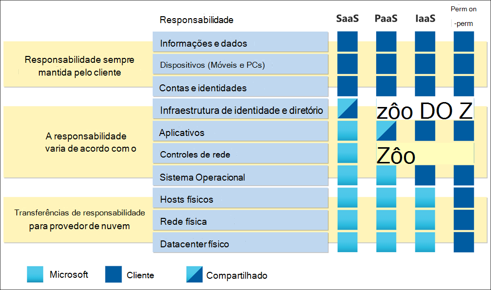

# Guia de Avaliação de Riscos do Microsoft Cloud

O objetivo de uma avaliação de risco na nuvem é garantir que o sistema e os dados considerados para migração para a nuvem não introduzam nenhum risco novo ou não identificado na organização. O foco é garantir confidencialidade, integridade, disponibilidade e privacidade do processamento de informações e manter os riscos identificados abaixo do limite de risco interno aceito.

Em um modelo de responsabilidade compartilhada, o Provedor de Serviços de Nuvem (CSP) é responsável por gerenciar a segurança e a conformidade da *nuvem* como provedor. O cliente permanece responsável por gerenciar e configurar a segurança e a conformidade na nuvem de acordo com suas necessidades e tolerância a riscos.

Neste guia, as práticas recomendadas são compartilhadas sobre como avaliar com eficiência os riscos do fornecedor e como usar os recursos e ferramentas que a Microsoft disponibiliza.

## Compreender a responsabilidade compartilhada na nuvem

As implantações em nuvem podem ser categorizadas como Infraestrutura como Serviço (IaaS), Plataforma como Serviço (PaaS) ou Software como Serviço (SaaS). Dependendo do modelo de serviço de nuvem aplicável, o nível de responsabilidade sobre os controles de segurança das soluções muda entre o CSP e o cliente. Em um modelo local tradicional, o cliente é responsável por toda a pilha. Ao mover para a nuvem, todas as responsabilidades de segurança física são transferidas para o CSP. Dependendo do modelo de serviço de nuvem da sua organização, as responsabilidades adicionais são deslocadas para o CSP. No entanto, na maioria dos modelos de serviço, sua organização permanece responsável pelos dispositivos usados para acessar a nuvem, conectividade de rede, suas contas e identidades e seus dados. A Microsoft investe pesadamente na criação de serviços que permitem que os clientes permaneçam no controle de seus dados em todo o ciclo de vida.

O Microsoft Cloud opera em uma hiperescala, confiando em uma combinação de DevSecOps e automação para padronizar modelos operacionais. O modelo operacional da Microsoft altera a maneira como o risco é abordado em comparação com os modelos operacionais locais tradicionais, levando à implementação de controles diferentes e, às vezes, desconhecidos para gerenciar riscos. Ao conduzir sua avaliação de risco na nuvem, lembre-se de que o objetivo da Microsoft é garantir que todos os riscos sejam resolvidos, mas não necessariamente implementar os mesmos controles que sua organização. A Microsoft pode lidar com os mesmos riscos com um conjunto diferente de controles e isso deve ser refletido na avaliação de risco na nuvem. Projetar e implementar controles preventivos fortes pode reduzir grande parte do trabalho exigido pelo detetive e controles corretivos.

## Adotar uma estrutura

A Microsoft recomenda que os clientes mapeiem sua estrutura interna de riscos e controles para uma estrutura independente que aborda os riscos de nuvem de forma padronizada. Se seus modelos de avaliação de riscos internos existentes não resolverem os desafios específicos que vêm com a computação em nuvem, você se beneficiará dessas estruturas amplamente adotadas e padronizadas. Um benefício secundário é que a Microsoft fornece mapeamentos em relação a essas estruturas na documentação e ferramentas que acelerarão suas avaliações de risco. Exemplos dessas estruturas incluem o padrão de segurança de [informações ISO 27001,](/compliance/regulatory/offering-iso-27001) [o CiS Benchmark](/compliance/regulatory/offering-cis-benchmark)e o [NIST SP 800-53](https://csrc.nist.gov/Projects/risk-management/sp800-53-controls/release-search#!/800-53). A Microsoft oferece o conjunto mais abrangente de ofertas de conformidade de qualquer CSP. Para obter mais informações, consulte [Ofertas de conformidade da Microsoft.](/compliance/regulatory/offering-home)

Use [o Microsoft Compliance Manager](/microsoft-365/compliance/compliance-manager) para criar suas próprias avaliações que avaliam a conformidade com o setor e os regulamentos regionais que se aplicam à sua organização. As avaliações são criadas com base na estrutura de modelos de avaliação, que contêm os controles necessários, as ações de melhoria e, quando aplicável, as ações da Microsoft para concluir a avaliação. Para ações da Microsoft, planos de implementação detalhados e resultados de auditoria recentes são fornecidos. Dessa forma, o tempo pode ser salvo na descoberta, mapeamento e pesquisa de como os controles específicos são implementados pela Microsoft. Para obter mais informações, consulte o artigo do Microsoft Compliance Manager.

## Entenda como a Microsoft opera para proteger seus dados

Embora o cliente seja responsável pelo gerenciamento e configuração de segurança e conformidade na nuvem, o CSP é responsável pelo gerenciamento da segurança e conformidade *da nuvem.* Uma maneira de validar que o CSP está efetivamente endereçando suas responsabilidades e mantendo suas promessas é revisar seus relatórios de auditoria externa, como ISO e SOC. A Microsoft disponibiliza relatórios de auditoria externa para audiências autenticadas no [Portal de Confiança do Serviço.](https://servicetrust.microsoft.com/ViewPage/MSComplianceGuideV3)

Além dos relatórios de auditoria externa, a Microsoft incentiva os clientes a aproveitarem os seguintes recursos para ajudar a entender a fundo como a Microsoft opera:

- [Caminho de Learning](/learn/roles/auditor)sob demanda : a plataforma Aprender da Microsoft oferece centenas de caminhos de aprendizado e módulos em diferentes tópicos. Entre eles, veja [Saiba como a Microsoft protege](/learn/paths/audit-safeguard-customer-data/) os dados do cliente para entender as práticas fundamentais de segurança e privacidade da Microsoft.

- [Service Assurance on Microsoft Compliance](/compliance/#service-assurance): Artigos sobre as práticas da Microsoft são categorizados em 16 domínios para facilitar a revisão. Cada domínio inclui uma visão geral que captura como a Microsoft está gerenciando os riscos associados a cada área. As tabelas de auditoria são fornecidas contendo links para os relatórios mais recentes armazenados no Portal de Confiança do Serviço, seções relacionadas e a data em que o relatório de auditoria foi conduzido para os serviços online da Microsoft. Se disponível, links para artefatos que demonstram a implementação de controle, como avaliações de vulnerabilidade de terceiros e relatórios de verificação do plano de continuidade de negócios são fornecidos. Como relatórios de auditoria, esses artefatos são hospedados em STP e exigem autenticação para acessar.

| **Domínio** |**Descrição** |
|:---------- |:-------------- |
| [**Arquitetura**](assurance-architecture.md) | O design dos serviços online da Microsoft e os princípios de segurança que atuam como sua base. |
| [**Registro de Auditoria**](assurance-audit-logging.md) | Como a Microsoft captura, processa, armazena e protege os logs que possibilitam o monitoramento de segurança e desempenho. |
| [**Segurança do datacenter**](assurance-datacenter-security.md) | Como a Microsoft opera com segurança os datacenters que fornecem os meios para operar os serviços online da Microsoft em todo o mundo. |
| [**Criptografia e gerenciamento de chaves**](assurance-encryption.md) | A proteção criptográfica das comunicações do cliente e os dados armazenados e processados na nuvem. |
| [**Governança**](assurance-governance.md) | Como a Microsoft cria, distribui, atualiza e impõe políticas de segurança em toda a empresa para atender às promessas do cliente e aos requisitos de conformidade. |
| [**Recursos humanos**](assurance-human-resources.md) | Os processos de triagem e o gerenciamento seguro da equipe durante todo o tempo na Microsoft. |
| [**Gerenciamento de identidades e acesso**](assurance-identity-and-access-management.md) | A proteção dos serviços online da Microsoft e dados do cliente contra acesso não autorizado ou mal-intencionado. |
| [**Gestão de incidentes**](assurance-incident-management.md) | Os processos que a Microsoft usa para se preparar, detectar, responder e comunicar todos os incidentes de segurança e privacidade. |
| [**Segurança de rede**](assurance-network-security.md) | Como a Microsoft protege seus limites de rede contra ataques externos e gerencia sua rede interna para limitar sua propagação. |
| [**Privacidade**](assurance-privacy.md) | Como a Microsoft lida e protege os dados do cliente para preservar seus direitos de dados. |
| [**Resiliência e continuidade**](assurance-resiliency-and-continuity.md) | Processo e tecnologias usadas para manter a disponibilidade do serviço e garantir a continuidade e a recuperação dos negócios. |
| [**Gerenciamento de risco**](assurance-risk-management.md) | A identificação, a avaliação e as ações tomadas para minimizar o risco em toda a empresa. |
| [**Desenvolvimento e operação de segurança**](assurance-security-development-and-operation.md) | Como a Microsoft garante que seus serviços sejam projetados, executados e gerenciados com segurança ao longo do ciclo de vida. |
| [**Monitoramento de segurança**](assurance-security-monitoring.md) | A análise central de logs para detectar e alertar o pessoal de qualquer atividade não autorizada ou mal-intencionada. |
| [**Gerenciamento de fornecedores**](assurance-supplier-management.md) | Como a Microsoft monitora e gerencia empresas de terceiros que ajudam com os serviços online da Microsoft. |
| [**Gerenciamento de Ameaças e Vulnerabilidades**](assurance-vulnerability-management.md) | Os processos que a Microsoft usa para verificar, detectar e resolver vulnerabilidades e malware. |

## Recursos

- [Guia de Avaliação e Conformidade de Riscos para Instituições Financeiras no Microsoft Cloud](https://servicetrust.microsoft.com/ViewPage/TrustDocumentsV3?command=Download&downloadType=Document&downloadId=edee9b14-3661-4a16-ba83-c35caf672bd7&tab=7f51cb60-3d6c-11e9-b2af-7bb9f5d2d913&docTab=7f51cb60-3d6c-11e9-b2af-7bb9f5d2d913_FAQ_and_White_Papers)
- [Risco de concentração: perspectivas da Microsoft](https://azure.microsoft.com/mediahandler/files/resourcefiles/concentration-risk-perspectives-from-microsoft-/Concentration_Risk_Perspectives_092020.pdf)
- [Portal de Confiança do Serviço](https://servicetrust.microsoft.com/)
