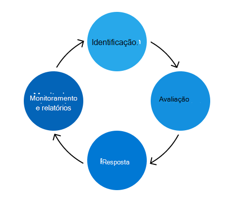

# Microsoft 365 Programa de Gerenciamento de Riscos

O objetivo do programa Microsoft 365 gerenciamento de riscos é identificar, avaliar e gerenciar riscos para Microsoft 365. A principal prioridade da Microsoft é identificar e resolver proativamente os riscos que podem afetar nossa infraestrutura de serviço, bem como nossos clientes, seus dados e sua confiança. Além disso, um programa robusto de gerenciamento de riscos é necessário para atender às obrigações contratuais e manter as acreditações públicas nas quais nossos clientes dependem para atender aos seus próprios requisitos de conformidade. Embora o Microsoft 365 de Gerenciamento de Riscos funcione independentemente, ele se alinha com as políticas, prioridades e metodologias do programa de Gerenciamento de Riscos (ERM) do Enterprise. Trabalhar com o programa ERM permite uma comparação consistente entre unidades de negócios e grupos de engenharia, contribuindo para uma abordagem mais coesiva para o gerenciamento de riscos em toda a empresa.

A Microsoft 365 de Confiança é responsável por gerenciar o programa Microsoft 365 Gerenciamento de Riscos e conduzir as atividades definidas pelo programa DEM. A equipe de Confiança se concentra na integração da estrutura de gerenciamento de riscos com o processo de engenharia, Microsoft 365 de serviço e conformidade existentes para tornar o programa de Gerenciamento de Riscos mais eficaz e eficiente.

A equipe de Confiança também mantém a Estrutura de Controles Microsoft 365, um conjunto de controles racionalizados que, quando implementados corretamente com atividades de conformidade, permitem que as equipes de engenharia cumpram as principais regulamentações e certificações. Essa estrutura é atualizada continuamente com base em comentários e descobertas como parte do processo de gerenciamento de riscos.

As atividades de gerenciamento de riscos se enquadram em quatro fases: identificação, avaliação, resposta e monitoramento e relatórios.

## Identificação

O processo de gerenciamento de riscos começa com a identificação de todos os riscos possíveis para todas as principais áreas de controle, ameaças internas e externas e vulnerabilidades no ambiente Microsoft 365 ambiente. As informações que orientam esse processo vêm de várias fontes, incluindo entrevistas, verificações de vulnerabilidade, exercícios de simulação de ataque, descobertas de auditoria e atividades de gerenciamento de incidentes.

As SMEs (especialistas em assuntos de assunto de entrevistas de equipe de confiança) de várias equipes de serviço em riscos identificados anteriormente e possíveis riscos futuros que podem ser introduzidos à medida que os serviços crescem. Além disso, as SMEs ajudam a validar a precisão e a totalidade dos riscos identificados de outras fontes de monitoramento contínuas.

A fase de identificação também é quando logs de decisão, exceções de segurança e conformidade ativas e trabalhos de mitigação de avaliações de risco anteriores são revisados.

## Avaliação

Cada risco identificado é avaliado usando três métricas: impacto, probabilidade e deficiência de controle.

- O impacto refere-se aos danos que ocorreriam ao serviço, aos negócios ou à Microsoft se esse risco fosse percebido. O impacto para a Microsoft pode incluir danos à reputação, perda de clientes ou implicações legais/de conformidade.
- A probabilidade define a probabilidade do risco potencial que está sendo realizado e é calculada analisando a probabilidade e a frequência com a qual ele ocorrerá.
- A deficiência de controle mede a eficácia dos controles de mitigação implementados.

Essas métricas são usadas para calcular uma pontuação de risco que representa a gravidade de cada risco, contabilizando as estratégias de mitigação existentes. Os riscos são agregados e apresentados aos principais participantes de cada serviço para verificar a precisão e a conclusão da postura de risco da Microsoft 365 da empresa.

## Resposta

Usando a lista verificada de riscos para Microsoft 365, a equipe de Confiança atribui riscos ao serviço afetado para resposta a riscos. As diretrizes definidas ajudam a determinar a estratégia de resposta de risco apropriada com base na pontuação de risco e na eficácia do controle. As estratégias de resposta de risco se enquadram em quatro categorias:

- Tolere: áreas de exposição de baixo risco com um baixo nível de controle.
- Opere: áreas de exposição de baixo risco em que os controles são considerados adequados.
- Monitore: áreas de exposição de alto risco em que os controles são considerados adequados e devem ser monitorados em caso de eficácia.
- Melhorar: áreas de exposição de alto risco com um baixo nível de controle que são as principais prioridades no endereçamento.

A equipe de Confiança coordena com equipes de serviço para desenvolver planos para lidar com cada risco. O nível de gravidade determina o nível apropriado de revisão e aprovação para cada plano. Para riscos que exigem ação, os processos de bugs de engenharia existentes são usados para controlar, gerenciar e tomar decisões de exceção. O uso de um processo familiar às equipes de engenharia e operação torna a resposta de risco mais eficiente e eficaz.

## Monitoramento e relatórios

Os riscos identificados como parte da avaliação de risco são monitorados e relatados aos stakeholders relevantes. As estratégias de monitoramento incluem monitoramento de segurança, análises periódicas de risco, testes de penetração e verificação de vulnerabilidades. Esses esforços de monitoramento atuam como fontes de dados para relatórios sobre os principais indicadores de desempenho, criação de painéis e desenvolvimento de relatórios formais, todos eles informam decisões futuras de risco.

Várias vezes por ano, a equipe de Confiança se reúne com proprietários de risco de cada serviço para revisar as pontuações de risco, avaliar a eficácia de seus planos de ação e fazer atualizações quando necessário. Além disso, as Microsoft 365 de avaliação de risco do Microsoft 365 contribuem para as Avaliações de Risco Enterprise do programa DEM, que fornecem uma visão geral de alto nível da postura de risco da Microsoft para o gerenciamento sênior da Microsoft e para o programa DEM.
