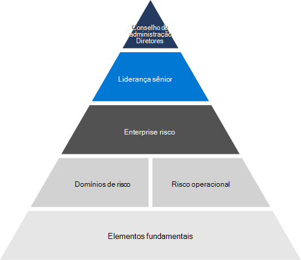

# Visão geral de gerenciamento de risco

## Como a Microsoft avalia e gerencia o risco em toda a empresa?

O gerenciamento de riscos é o processo de identificação, avaliação e resposta ao risco. O gerenciamento de riscos na Microsoft foi projetado para prever novas ameaças e fornecer segurança contínua para nossos sistemas de nuvem e para os clientes que as usam.

As atividades de gerenciamento de riscos da Microsoft são governadas pelo programa Enterprise Gerenciamento de Riscos (ERM). O ERM habilita o processo geral de gerenciamento de riscos corporativos e trabalha com gerenciamento em toda a empresa para identificar e garantir a responsabilidade pelos riscos mais significativos da Microsoft. Ele se concentra na antecipação, avaliação e relatórios de riscos para informar a estratégia de negócios da Microsoft e impulsionar a mitigação de riscos e a responsabilidade.

O Microsoft ERM coordena as atividades de gerenciamento de riscos em toda a empresa para permitir que as unidades de negócios facilitem de forma independente avaliações de risco consistentes e comparativas. Essa coordenação oferece à Microsoft a capacidade de agregar e relatar informações de risco de forma consolidada para o gerenciamento. O ERM fornece unidades de negócios na Microsoft com metodologias, ferramentas e metas comuns para o processo de gerenciamento de riscos. Microsoft 365 e outros grupos de engenharia e unidades de negócios usam essas ferramentas para conduzir avaliações de risco individuais como parte de seus próprios programas de gerenciamento de riscos sob as diretrizes do ERM.

## Como o Microsoft 365 funciona com o ERM?

O Microsoft 365 de Gerenciamento de Riscos segue as diretrizes do ERM para gerenciar riscos em Microsoft 365 serviços. O programa se concentra em alinhar a estrutura do ERM com processos de engenharia, Microsoft 365, operações de serviço e conformidade existentes, tornando o programa de Gerenciamento de Riscos mais eficaz e eficiente. Microsoft 365 atividades de gerenciamento de riscos da empresa, em última análise, são realizadas e informam o processo DEM.

Como parte das atividades de avaliação de risco, o programa Microsoft 365 Gerenciamento de Riscos analisa o design e a eficácia operacional dos controles implementados como parte da Estrutura de Controles Microsoft 365 (Framework). O Framework é um conjunto racionalizado de controles que, quando implementado corretamente junto com atividades de conformidade, permite que as equipes de engenharia cumpram as principais regulamentações e certificações.

## Como a Microsoft 365 gerencia e avalia o risco em seus serviços online?

Como parte das atividades de avaliação de risco em andamento, o programa Microsoft 365 Gerenciamento de Riscos realiza entrevistas com as equipes de serviço que projetam, constroem e operam serviços Microsoft 365 para identificar os riscos atuais e áreas de preocupação. Essas atividades, juntamente com a análise de dados de monitoramento contínuo, auditorias e outras fontes, são usadas para desenvolver relatórios de avaliação de riscos que identificam riscos atuais e possíveis futuros para metas de negócios de longo prazo. Os relatórios de avaliação de riscos fornecem uma visão geral de alto nível Microsoft 365 postura de risco da Microsoft 365 com base em nossas descobertas e comentários de Microsoft 365 equipes de serviço. Juntamente com relatórios semelhantes de outras unidades de negócios, Microsoft 365 relatórios de avaliação de risco contribuem e informam avaliações de risco do programa DEM.

Microsoft 365 A confiança é um grupo responsável por dar suporte a operações de garantia relacionadas à conformidade da política, aos requisitos de segurança e ao gerenciamento de riscos. Microsoft 365 A confiança funciona para identificar novos riscos à medida que eles surgem e monitoram riscos conhecidos e respostas de risco. Comentários de Microsoft 365 equipes de serviço e dados de monitoramento contínuos Microsoft 365 ambientes informam esse processo. O sucesso e a falha das respostas de risco são acompanhados para desenvolver e informar a análise de probabilidades e impactos de risco. Reuniões de revisão de riscos regulares com proprietários de risco permitem Microsoft 365 Confiança para atualizar e gerenciar respostas de risco.

## Regulamentações externas relacionadas & certificações

Os serviços online da Microsoft são regularmente auditados para conformidade com regulamentações e certificações externas. Consulte a tabela a seguir para validação de controles relacionados ao gerenciamento de riscos.

| **Auditorias externas** | **Section** | **Data do relatório mais recente** |
|:--------------------|:------------|:-----------------------|
| [FedRAMP (Office 365)](https://compliance.microsoft.com/compliancemanager) | CA-2: Avaliações de segurança   CA-5: Plano de ações e etapas   RA-3: Avaliação de risco | 24 de setembro de 2020 |
| [ISO 27001/27002 (Office 365)](https://servicetrust.microsoft.com/ViewPage/MSComplianceGuideV3?command=Download&downloadType=Document&downloadId=8d625374-4f2d-49f8-9d37-a4281ba98222&tab=7027ead0-3d6b-11e9-b9e1-290b1eb4cdeb&docTab=7027ead0-3d6b-11e9-b9e1-290b1eb4cdeb_ISO_Reports)    [Instrução of Applicability](https://servicetrust.microsoft.com/ViewPage/MSComplianceGuideV3?command=Download&downloadType=Document&downloadId=c0df4ce8-c77e-4183-84eb-c8688470d8b1&tab=7027ead0-3d6b-11e9-b9e1-290b1eb4cdeb&docTab=7027ead0-3d6b-11e9-b9e1-290b1eb4cdeb_ISO_Reports)   [Certificação](https://servicetrust.microsoft.com/ViewPage/MSComplianceGuideV3?command=Download&downloadType=Document&downloadId=1e84a14a-2468-45ac-9412-5e53250d57ec&tab=7027ead0-3d6b-11e9-b9e1-290b1eb4cdeb&docTab=7027ead0-3d6b-11e9-b9e1-290b1eb4cdeb_ISO_Reports) | A.5: Políticas de segurança de informações | Abril de 20, 2021 |
| [ISO 27017 (Office 365)](https://servicetrust.microsoft.com/ViewPage/MSComplianceGuideV3?command=Download&downloadType=Document&downloadId=8d625374-4f2d-49f8-9d37-a4281ba98222&tab=7027ead0-3d6b-11e9-b9e1-290b1eb4cdeb&docTab=7027ead0-3d6b-11e9-b9e1-290b1eb4cdeb_ISO_Reports)    [Instrução of Applicability](https://servicetrust.microsoft.com/ViewPage/MSComplianceGuideV3?command=Download&downloadType=Document&downloadId=c0df4ce8-c77e-4183-84eb-c8688470d8b1&tab=7027ead0-3d6b-11e9-b9e1-290b1eb4cdeb&docTab=7027ead0-3d6b-11e9-b9e1-290b1eb4cdeb_ISO_Reports)   [Certificação](https://servicetrust.microsoft.com/ViewPage/MSComplianceGuideV3?command=Download&downloadType=Document&downloadId=70de0999-5451-43a3-9ef4-761e8fbfb1a3&tab=7027ead0-3d6b-11e9-b9e1-290b1eb4cdeb&docTab=7027ead0-3d6b-11e9-b9e1-290b1eb4cdeb_ISO_Reports) | A.5: Políticas de segurança de informações | Abril de 20, 2021 |
| [SOC 1 (Office 365)](https://servicetrust.microsoft.com/ViewPage/MSComplianceGuideV3?command=Download&downloadType=Document&downloadId=90df3f9c-3aaf-4dbf-99d0-ca9f2991721b&tab=7027ead0-3d6b-11e9-b9e1-290b1eb4cdeb&docTab=7027ead0-3d6b-11e9-b9e1-290b1eb4cdeb_SOC_%2F_SSAE_16_Reports) | CA-03: Gerenciamento de riscos | 24 de dezembro de 2020 |
| [SOC 2 (Office 365)](https://servicetrust.microsoft.com/ViewPage/MSComplianceGuideV3?command=Download&downloadType=Document&downloadId=a73c1738-7892-42b7-acd3-87b6371c53f6&tab=7027ead0-3d6b-11e9-b9e1-290b1eb4cdeb&docTab=7027ead0-3d6b-11e9-b9e1-290b1eb4cdeb_SOC_%2F_SSAE_16_Reports) | CA-02: responsabilidades de equipe de governança, risco e conformidade   CA-03: Gerenciamento de riscos   CA-17: Política de segurança da Microsoft   CA-24: Avaliação de risco interno | 24 de dezembro de 2020 |
