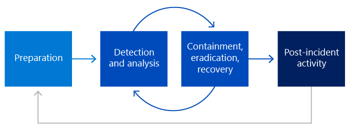

# Gerenciamento de incidentes de segurança da MicrosoftMicrosoft security incident management

A Microsoft trabalha continuamente para fornecer serviços de nível empresarial altamente seguros para os clientes da Microsoft, mas os incidentes de segurança são uma realidade inevitável que deve ser gerenciada de forma completa e rápida.Microsoft works continuously to provide highly secure, enterprise-grade services for Microsoft customers, but security incidents are an inevitable reality that must be thoroughly and swiftly managed. Este documento fornece uma visão geral sobre como a Microsoft lida com incidentes de segurança usando métodos e tecnologias tentados e verdadeiros para minimizar seu impacto potencial.This document provides an overview on how Microsoft handles security incidents using tried and true methods and technologies to minimize their potential impact. Um incidente de segurança refere-se a qualquer acesso ilegal aos dados do cliente armazenados no equipamento da Microsoft ou nas instalações da Microsoft ou acesso não autorizado a esses equipamentos ou instalações que tenham o potencial de resultar na perda, divulgação ou alteração de dados do cliente.A security incident refers to any unlawful access to customer data stored on Microsoft's equipment or in Microsoft's facilities, or unauthorized access to such equipment or facilities that have the potential to result in the loss, disclosure, or alteration of customer data. As metas da Microsoft ao responder a incidentes de segurança são proteger os dados do cliente e os serviços online da Microsoft.Microsoft's goals when responding to security incidents are to protect customer data and Microsoft's online services.

As equipes de segurança dos serviços online da Microsoft e as várias equipes de serviço trabalham em conjunto e têm a mesma abordagem para incidentes de segurança:Microsoft online services security teams and the various service teams work jointly and take the same approach to security incidents:

- PreparaçãoPreparation
- Detecção e análiseDetection and Analysis
- Contenção, Erradicação e RecuperaçãoContainment, Eradication, and Recovery
- Atividade pós-incidentePost-Incident Activity

## Abordagem da Microsoft para o gerenciamento de incidentes de segurançaMicrosoft approach to security incident management

A abordagem da Microsoft para gerenciar um incidente de segurança está em conformidade com a Publicação Especial (SP) 800-61 do Instituto Nacional de Padrões e Tecnologia [(NIST).](https://www.nist.gov/)Microsoft's approach to managing a security incident conforms to [National Institute of Standards and Technology (NIST)](https://www.nist.gov/) Special Publication (SP) 800-61. A Microsoft tem várias equipes dedicadas que trabalham juntas para evitar, monitorar, detectar e responder a incidentes de segurança.Microsoft has several dedicated teams that work together to prevent, monitor, detect, and respond to security incidents.

|**Equipe/Área****Team/Area**|**Descrição****Description**|
|:------------|:--------------|
| Centro de Resposta de Segurança da MicrosoftMicrosoft Security Response Center | Identifica, monitora, resolve e responde a incidentes de segurança e vulnerabilidades de segurança de software da Microsoft.Identifies, monitors, resolves, and responds to security incidents and Microsoft software security vulnerabilities. |
| Centro de Operações de Defesa CibernéticaCyber Defense Operations Center | O Centro de Operações de Defesa Cibernética é o local físico que reúne equipes de resposta de segurança e especialistas de toda a empresa para ajudar a proteger, detectar e responder a ameaças em tempo real.The Cyber Defense Operations Center is the physical location that brings together security response teams and experts from across the company to help protect, detect, and respond to threats in real time. |
| Assuntos corporativos, externos e jurídicosCorporate, External, and Legal Affairs | Fornece orientações legais e regulatórias para um incidente de segurança suspeito.Provides legal and regulatory advice for a suspected security incident. |
| Equipe de Segurança do Microsoft DatacenterMicrosoft Datacenter Security Team | Equipe que se concentra nos vários serviços em investimentos comuns de engenharia de segurança para proteger, detectar e responder a riscos e ameaças da arquitetura de serviço.Team that focuses across the various services on common security engineering investments to protect, detect, and respond to service architecture risks and threats. |
| Equipes de resposta de segurança da MicrosoftMicrosoft security response teams | Equipes de segurança independentes do Azure, do Dynamics 365 e Microsoft 365 que são parceiras com equipes de serviço para criar o processo de gerenciamento de incidentes de segurança apropriado e para conduzir qualquer resposta a incidentes de segurança.Independent Azure, Dynamics 365, and Microsoft 365 security teams that partner with service teams to build the appropriate security incident management process and to drive any security incident response. |
| Equipes de Governança, Risco e Conformidade (GRC) da MicrosoftMicrosoft Governance, Risk, and Compliance (GRC) teams | Forneça orientações sobre requisitos regulatórios, conformidade e privacidade.Provide guidance on regulatory requirements, compliance, and privacy. |
| Equipes de serviçoService teams | Equipes de engenharia do Azure, Dynamics 365, Microsoft 365 que são responsáveis por políticas e decisões relacionadas à segurança para cada serviço.Engineering teams for Azure, Dynamics 365, Microsoft 365 that are responsible for security-related policies and decisions for each service. |
| Gerentes de operações do AzureAzure operations managers | Supervisiona a investigação e a resolução de incidentes de segurança e privacidade relacionados ao Azure.Oversees the investigation and resolution of Azure-related security and privacy incidents. |
| Microsoft Threat Intelligence Center (MSTIC)Microsoft Threat Intelligence Center (MSTIC) | Fornece o estado de arte atual em ameaças de segurança digital contra a infraestrutura e ativos da Microsoft, ajuda as equipes parceiras dentro da Microsoft a priorizar planos de ação de mitigação e prevenção e aumenta a proteção adotando o monitoramento/detecção de incidentes quase em tempo real.Provides the current state of art in digital security threats against Microsoft infrastructure and assets, helps partner teams inside Microsoft prioritize mitigation and prevention effort action plans, and increases protection by adopting near real-time incident monitoring/detection. |
| Equipes de comunicação de experiência do clienteCustomer experience communication teams | Equipes de engenharia responsáveis por todas as comunicações do cliente sobre incidentes de segurança e serviço.Engineering teams responsible for all customer communications about security and service incidents. As equipes separadas são dedicadas ao Azure, Ao Dynamics 365 e Microsoft 365.Separate teams are dedicated to Azure, Dynamics 365, and Microsoft 365. |

## Processo de gerenciamento de respostaResponse management process

As equipes de segurança e de serviços online da Microsoft trabalham em conjunto e têm a mesma abordagem para incidentes de segurança, que se baseia nas fases de gerenciamento de resposta do NIST 800-61:Microsoft online services security teams and service teams work together on and take the same approach to security incidents, which is based on the NIST 800-61 response management phases:

- **Preparação**: refere-se à preparação organizacional necessária para poder responder, incluindo ferramentas, processos, competências e preparação.**Preparation**: Refers to the organizational preparation that is needed to be able to respond, including tools, processes, competencies, and readiness.
- **Análise & detecção**: refere-se à atividade para detectar um incidente de segurança em um ambiente de produção e analisar todos os eventos para confirmar a autenticidade do incidente de segurança.**Detection & analysis**: Refers to the activity to detect a security incident in a production environment and to analyze all events to confirm the authenticity of the security incident.
- **Contenção, erradicação, recuperação**: refere-se às ações necessárias e apropriadas tomadas para conter o incidente de segurança com base na análise feita na fase anterior.**Containment, eradication, recovery**: Refers to the required and appropriate actions taken to contain the security incident based on the analysis done in the previous phase. Mais análises também podem ser necessárias nesta fase para a recuperação completa do incidente de segurança.More analysis may also be necessary in this phase to fully recovery from the security incident.
- **Atividade pós-incidente**: refere-se à análise pós-mortem realizada após a recuperação de um incidente de segurança.**Post-incident activity**: Refers to the post-mortem analysis performed after the recovery of a security incident. As ações operacionais executadas durante o processo são revisadas para determinar se alguma alteração precisa ser feita nas fases de preparação ou detecção e análise.The operational actions performed during the process are reviewed to determine if any changes need to be made in the preparation or detection and analysis phases.

## Modelo de resposta de segurança federadaFederated security response model

Os serviços online da Microsoft consistem em produtos principais da Microsoft, incluindo o Azure, o Dynamics 365 e o Microsoft 365.Microsoft online services consist of core Microsoft products, including Azure, Dynamics 365, and Microsoft 365. Cada um desses serviços é operado por equipes separadas com seus próprios processos operacionais de segurança.Each of these services are operated by separate teams with their own security operational processes. Outras equipes da Microsoft, como o MSTIC, também estão envolvidas em vários aspectos de segurança dos serviços online da Microsoft.Other teams at Microsoft, such as MSTIC, are also engaged in various security aspects of Microsoft online services. Devido à multiplicidade de equipes que trabalham no gerenciamento de operações de segurança em todos os vários serviços online da Microsoft, a Microsoft implementou um modelo de resposta de segurança federado.Because of the multitude of teams working on security operations management across all the various services that make up Microsoft online services, Microsoft has implemented a federated security response model.

Esta tabela apresenta os limites operacionais entre as várias equipes de operações de segurança do serviço online da Microsoft e as equipes de serviço da Microsoft:This table presents the operational boundaries between the various Microsoft online service security operations teams and the Microsoft service teams:

|**Atividades****Activity**|**Operações da Equipe de Segurança da Microsoft****Microsoft Security Team Operations**|**Operações de equipe de serviço da Microsoft****Microsoft Service Team Operations**|
|:-----------|:-----------------------------------------|:----------------------------------------|
| Detecção e análiseDetection and analysis | - Requisitos de detecção- Detection requirements   - Monitoramento e análise de segurança- Security monitoring and analysis   - Indicador de varreduras de comprometimento (IOC)- Indicator of compromise (IOC) sweeps   - Busca de violação- Breach hunt   - Líder de resposta a incidentes e segurança 24x7- 24x7 security on-call and incident response lead | - Requisitos de detecção- Detection requirements   - Monitoramento da implantação de infraestrutura- Monitoring infrastructure deployment   - Análise e visão do serviço- Service analysis and insight   - Triagem de eventos e alertas- Event and alert triage   - Engenharia de serviço 24x7 em chamada- 24x7 service engineering on-call  |
| Contenção, erradicação, recuperaçãoContainment, eradication, recovery | - Líder de resposta a incidentes- Incident response lead   - Investigação forense- Forensics investigation   - Experiência em segurança e consultoria- Security expertise and consulting   - Diretrizes de recuperação- Recovery guidance | - Proprietário de incidentes de segurança- Security incident owner   - Experiência e experiência do serviço- Service insight and expertise   - Executar contenção, erradicação e recuperação- Execute containment, eradication, and recovery |
| Atividade pós-incidentePost-incident activity | - Líder de análise pós-incidente- Post-incident analysis lead   - Coleta e arquivamento de dados- Data collection and archival   - Lições aprendidas e solicitações de bugs- Lessons learned and bug requests   - Relatório de incidentes- Incident reporting | - Análise de incidentes do lado do serviço- Service-side incident analysis   - Priorizar atividades de acompanhamento- Prioritize follow-up activities   - Implementação de investimentos em segurança- Implementation security investments   - Preparação de segurança do serviço- Service security readiness |

## Artigos relacionadosRelated articles

- [Gerenciamento de incidentes de segurança da Microsoft: PreparaçãoMicrosoft security incident management: Preparation](assurance-sim-preparation.md)
- [Gerenciamento de incidentes de segurança da Microsoft: Detecção e análiseMicrosoft security incident management: Detection and analysis](assurance-sim-detection-analysis.md)
- [Gerenciamento de incidentes de segurança da Microsoft: contenção, erradicação e recuperaçãoMicrosoft security incident management: Containment, eradication, and recovery](assurance-sim-containment-eradication-recovery.md)
- [Gerenciamento de incidentes de segurança da Microsoft: atividade pós-incidenteMicrosoft security incident management: Post-incident activity](assurance-sim-post-incident-activity.md)
