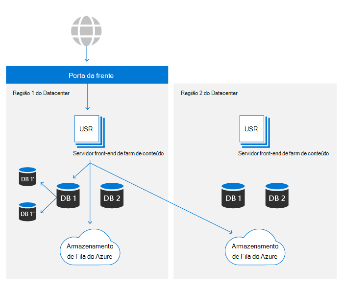
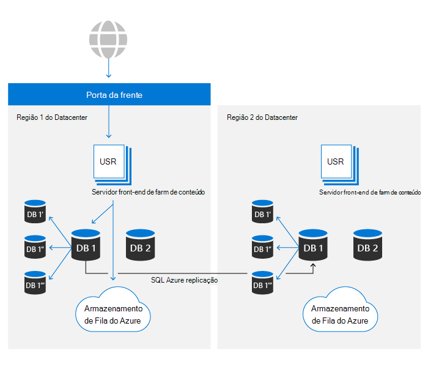

# Resiliência de dados do SharePoint e OneDrive no Microsoft 365 SharePoint and OneDrive data resiliency in Microsoft 365

No Microsoft 365, o OneDrive é criado sobre a plataforma de arquivos do SharePoint.Within Microsoft 365, OneDrive is built on top of the SharePoint file platform. Neste artigo, somente o SharePoint será usado para se referir a ambos os produtos.In this article, only SharePoint will be used to refer to both products. O conteúdo deste artigo é relevante para o Microsoft 365 e não se aplica aos serviços de consumidor.The contents of this article are relevant to Microsoft 365 and do not apply to consumer services.

Há dois ativos principais que compoem o armazenamento de conteúdo principal do SharePoint:There are two primary assets that make up the core content storage of SharePoint:

- **Metadados**: Os metadados sobre cada arquivo são armazenados no Banco de Dados do Azure SQL.**Metadata**: Metadata about each file is stored in Azure SQL Database. O Azure SQL oferece uma história completa de continuidade de negócios que o SharePoint usa e os detalhes são abordados posteriormente neste artigo.Azure SQL offers a complete business continuity story that SharePoint uses and details are covered later in this article.
- **Armazenamento de blob**: O conteúdo do usuário carregado no SharePoint é armazenado no Armazenamento do Azure.**Blob storage**: User content that is uploaded into SharePoint is stored in Azure Storage. O SharePoint criou um plano de resiliência personalizado em cima do Armazenamento do Azure para garantir a duplicação quase em tempo real do conteúdo do usuário e um sistema realmente ativo/ativo.SharePoint has built a custom resiliency plan on top of Azure Storage to ensure near real-time duplication of user content and a truly active/active system.

O conjunto completo de controles para garantir a resiliência de dados é explicado em seções posteriores.The complete set of controls to ensure data resiliency is explained in further sections.

## Resiliência de armazenamento de blobBlob storage resilience

O SharePoint tem uma solução personalizada para armazenamento de dados do cliente no Armazenamento do Azure.SharePoint has a custom-built solution for storage of customer data in Azure Storage. Cada arquivo é gravado simultaneamente em uma região de datacenter principal e secundária.Every file is simultaneously written into both a primary and a secondary datacenter region. Se as gravações na região do Azure falharem, o arquivo salvo falhará.If writes to either Azure region fail, the file save will fail. Depois que o conteúdo é gravado no Armazenamento do Azure, os checksums são armazenados separadamente com metadados e são usados para garantir que a gravação comprometida seja idêntica ao arquivo original enviado ao SharePoint durante todas as leituras futuras.After the contents are written into Azure Storage, checksums are stored separately with metadata, and are used to ensure that the committed write is identical to the original file sent to SharePoint during all future reads. Essa mesma técnica é usada em todos os fluxos de trabalho para evitar a propagação de qualquer corrupção que deve ocorrer.This same technique is used in all workflows to prevent propagation of any corruption that should occur. Em cada região, o Armazenamento Redundante Local do Azure (LRS) fornece um alto nível de confiabilidade.Within each region, Azure Locally Redundant Storage (LRS) provides a high level of reliability. Consulte o [artigo de redundância do Armazenamento do Azure](/azure/storage/common/storage-redundancy-lrs) para obter detalhes.See the [Azure Storage redundancy](/azure/storage/common/storage-redundancy-lrs) article for details.

O SharePoint usa Append-Only armazenamento.SharePoint uses Append-Only storage. Esse processo garante que os arquivos não possam ser alterados ou corrompidos após uma salvação inicial, mas também usando o versionamento no produto, qualquer versão anterior do conteúdo do arquivo pode ser recuperada.This process ensures that files cannot be changed or corrupted after an initial save, but also by using in-product versioning, any previous version of the file contents can be retrieved.

Os ambientes do SharePoint em um datacenter podem acessar contêineres de armazenamento em ambas as regiões do Azure.SharePoint environments in either datacenter can access storage containers in both Azure regions. Por motivos de desempenho, o contêiner de armazenamento no mesmo datacenter local é sempre preferencial, no entanto, as solicitações de leitura que não veem resultados dentro de um limite desejado terão o mesmo conteúdo solicitado do datacenter remoto para garantir que os dados sempre estão disponíveis.For performance reasons the storage container in the same local datacenter is always preferred, however, read requests that do not see results within a desired threshold will have the same content requested from the remote datacenter to ensure data is always available.

## Resiliência de metadadosMetadata resilience

Os metadados do SharePoint também são essenciais para acessar o conteúdo do usuário, pois armazenam o local e as chaves de acesso ao conteúdo armazenado no Armazenamento do Azure.SharePoint metadata is also critical to accessing user content as it stores the location of and access keys to the content stored in Azure Storage. Esses bancos de dados são armazenados no Azure SQL, que tem um plano extensivo [de continuidade de negócios.](/azure/sql-database/sql-database-business-continuity)These databases are stored in Azure SQL, which has an extensive [business continuity plan](/azure/sql-database/sql-database-business-continuity).

O SharePoint usa o modelo de replicação fornecido pelo Azure SQL e criou uma tecnologia de automação proprietária para determinar que um failover é necessário e iniciar a operação, se necessário.SharePoint uses the replication model provided by Azure SQL and has built a proprietary automation technology to determine a failover is required and to initiate the operation if necessary. Dessa forma, ele se enquadra na categoria "Failover de banco de dados manual" de uma perspectiva SQL do Azure.As such, it falls into the 'Manual database failover' category from an Azure SQL perspective. As métricas mais recentes para a recuperação SQL banco de dados do Azure estão disponíveis [aqui](/azure/azure-sql/database/business-continuity-high-availability-disaster-recover-hadr-overview#recover-a-database-to-the-existing-server).The latest metrics for Azure SQL database recoverability are available [here](/azure/azure-sql/database/business-continuity-high-availability-disaster-recover-hadr-overview#recover-a-database-to-the-existing-server).

O SharePoint usa o SQL de backup do Azure para habilitar o PITR (Point in Time Restores) por até 14 dias.SharePoint uses Azure SQL's backup system to enable Point in Time Restores (PITR) for up to 14 days. O PITR é abordado mais em [uma seção posterior.](#deletion-backup-and-point-in-time-restore)PITR is covered more in a [later section.](#deletion-backup-and-point-in-time-restore)

## Failover automatizadoAutomated failover

O SharePoint usa um failover automatizado personalizado para minimizar o impacto na experiência do cliente quando ocorre um evento específico de local.SharePoint uses a custom-built automated failover to minimize the impact on customer experience when a location-specific event occurs. A automação controlada pelo monitoramento detectando uma falha única ou multi componente além de determinados limites resultará em redirecionamento automatizado da atividade de todos os usuários fora do ambiente problemático e em um secundário quente.Monitoring-driven automation detecting a single or multi-component failure beyond certain thresholds will result in automated redirection of all users' activity out of the problematic environment and over to a warm secondary. Um failover resulta em metadados e armazenamento de computação sendo atendido inteiramente fora do novo datacenter.A failover results in metadata and compute storage being served entirely out of the new datacenter. Como o armazenamento de blob sempre é executado totalmente ativo/ativo, nenhuma alteração é necessária para um failover.As blob storage always runs entirely active/active, no change is required for a failover. A camada de computação preferirá o contêiner de blob mais próximo, mas usará locais de armazenamento de blob remoto e local a qualquer momento para garantir a disponibilidade.The compute tier will prefer the nearest blob container but will use both local and remote blob storage locations at any time to ensure availability.

O SharePoint usa o serviço porta da frente do Azure para fornecer roteamento interno para a rede da Microsoft.SharePoint uses the Azure Front Door service to provide routing internal to the Microsoft network. Essa configuração permite o redirecionamento de failover independente do DNS e reduz o efeito do cache da máquina local.This configuration allows failover redirection independent of DNS and reduces the effect of local-machine caching. A maioria das operações de failover são transparentes para usuários finais.Most failover operations are transparent to end users. Se houver um failover, os clientes não precisarão fazer alterações para manter o acesso ao serviço.If there is a failover, customers will not need to make any changes in order to maintain access to the service.

## Versão e restauração de arquivosVersioning and Files Restore

Para bibliotecas de documentos recém-criadas, o SharePoint padrão para 500 versões em cada arquivo e pode ser configurado para reter mais versões, se desejado.For newly created document libraries, SharePoint defaults to 500 versions on every file and can be configured to retain more versions if desired. A interface do usuário não permite que um valor menor que 100 versões seja definido, mas é possível definir o sistema para armazenar menos versões usando APIs públicas.The UI doesn't allow a value fewer than 100 versions to be set, but it is possible to set the system to store fewer versions using public APIs. Para confiabilidade, qualquer valor menor que 100 não é recomendado e pode resultar em atividade do usuário causando perda de dados inadvertida.For reliability, any value less than 100 isn't recommended and can result in user activity causing inadvertent data loss.

Para obter mais informações sobre o versioning, consulte [Versioning in SharePoint](/microsoft-365/community/versioning-basics-best-practices).For more information about versioning, see [Versioning in SharePoint](/microsoft-365/community/versioning-basics-best-practices).

A restauração de arquivos é a capacidade de voltar "no tempo" em qualquer Biblioteca de Documentos no SharePoint a qualquer segundo tempo nos últimos 30 dias.Files Restore is the ability to go 'back in time' on any Document Library in SharePoint to any second of time in the last 30 days. Esse processo pode ser usado para recuperar de ransomware, exclusões em massa, corrupção ou qualquer outro evento.This process can be used to recover from ransomware, mass deletions, corruption, or any other event. Esse recurso usa versões de arquivo para reduzir versões padrão pode reduzir a eficácia dessa restauração.This feature uses file versions so reducing default versions can reduce the effectiveness of this restore.

O recurso Restauração de Arquivos está documentado para [o OneDrive](https://support.office.com/article/restore-your-onedrive-fa231298-759d-41cf-bcd0-25ac53eb8a15) e [o SharePoint.](https://support.office.com/article/Restore-a-document-library-317791c3-8bd0-4dfd-8254-3ca90883d39a)The Files Restore feature is documented for both [OneDrive](https://support.office.com/article/restore-your-onedrive-fa231298-759d-41cf-bcd0-25ac53eb8a15) and [SharePoint](https://support.office.com/article/Restore-a-document-library-317791c3-8bd0-4dfd-8254-3ca90883d39a).

## Exclusão, backup e Restauração de Ponto no TempoDeletion, backup, and Point in Time Restore

O conteúdo do usuário excluído do SharePoint passa pelo seguinte fluxo de exclusão.User content deleted from SharePoint goes through the following deletion flow.

Os itens excluídos são mantidos em lixeiras por um determinado período de tempo.Deleted items are retained in recycle bins for a certain period of time. Para o SharePoint, o tempo de retenção é de 93 dias.For SharePoint, the retention time is 93 days. Ele começa quando você exclui o item de seu local original.It begins when you delete the item from its original location. Quando você exclui o item da lixeira do site, ele entra na lixeira [do conjunto de sites.](https://support.office.com/article/restore-deleted-items-from-the-site-collection-recycle-bin-5fa924ee-16d7-487b-9a0a-021b9062d14b)When you delete the item from the site recycle bin, it goes into the [site collection recycle bin](https://support.office.com/article/restore-deleted-items-from-the-site-collection-recycle-bin-5fa924ee-16d7-487b-9a0a-021b9062d14b). Ele permanece lá pelo restante dos 93 dias e, em seguida, é excluído permanentemente.It stays there for the remainder of the 93 days, and then is permanently deleted. Mais informações sobre como usar a lixeira estão disponíveis nestes links:More information about how to use the recycle bin is available at these links:

- [Restaurar itens na LixeiraRestore items in the Recycle Bin](https://support.office.com/article/Restore-items-in-the-Recycle-Bin-of-a-SharePoint-site-6df466b6-55f2-4898-8d6e-c0dff851a0be)
- [Restaurar itens excluídos da Lixeira do Conjunto de Sites.](https://support.office.com/article/Restore-deleted-items-from-the-site-collection-recycle-bin-5fa924ee-16d7-487b-9a0a-021b9062d14b)[Restore deleted items from the Site Collection Recycle Bin](https://support.office.com/article/Restore-deleted-items-from-the-site-collection-recycle-bin-5fa924ee-16d7-487b-9a0a-021b9062d14b).

Esse processo é o fluxo de exclusão padrão e não leva em conta políticas ou rótulos de retenção.This process is the default deletion flow and does not take into account retention policies or labels. Para obter mais informações, [consulte Learn about retention for SharePoint and OneDrive](/microsoft-365/compliance/retention-policies-sharepoint).For more information, see [Learn about retention for SharePoint and OneDrive](/microsoft-365/compliance/retention-policies-sharepoint).

Após a conclusão do pipeline de reciclagem de 93 dias, a exclusão ocorre independentemente para Metadados e para Armazenamento de Blob.After the 93-day recycle pipeline is complete, deletion takes place independently for Metadata and for Blob Storage. Os metadados serão removidos imediatamente do banco de dados, o que torna o conteúdo ilegível, a menos que os metadados sejam restaurados do backup.Metadata will be removed immediately from the database, which makes the content unreadable unless the metadata is restored from backup. O SharePoint mantém 14 dias de backups de metadados.SharePoint maintains 14 days-worth of backups of metadata. Esses backups são feitos localmente em tempo quase real e, em [seguida,](/azure/sql-database/sql-database-automated-backups) são levados para o armazenamento em contêineres redundantes de Armazenamento do Azure, de acordo com a documentação no momento desta publicação, um cronograma de 5 a 10 minutos.These backups are taken locally in near real time and then pushed to storage in redundant Azure Storage containers on, [according to documentation](/azure/sql-database/sql-database-automated-backups) at the time of this publication, a 5-10-minute schedule.

Ao excluir conteúdo de Armazenamento de Blob, o SharePoint utiliza o recurso de exclusão suave para o Armazenamento de Blob do Azure para proteger contra exclusão acidental ou mal-intencionada.When deleting Blob Storage content, SharePoint utilizes the soft delete feature for Azure Blob Storage to protect against accidental or malicious deletion. Usando esse recurso, temos um total de 14 dias para restaurar o conteúdo antes que ele seja excluído permanentemente.Using this feature, we have a total of 14 days in which to restore content before it is permanently deleted.

>[!Note]
>Embora os aplicativos da Microsoft enviem conteúdo para a lixeira para o processo padrão, o SharePoint fornece APIs que permitem ignorar a lixeira e forçar uma exclusão imediata.While Microsoft applications will send content to the recycle bin for the standard process, SharePoint does provide APIs that allow for skipping the recycle bin and forcing an immediate delete. Revise seus aplicativos para garantir que isso só seja feito quando necessário por motivos de conformidade.Review your applications to ensure this is only done when necessary for compliance reasons.

## Verificações de integridadeIntegrity Checks

O SharePoint usa vários métodos para garantir a integridade de blobs e metadados em todos os estágios do ciclo de vida dos dados:SharePoint uses various methods to ensure the integrity of blobs and metadata at all stages of the data lifecycle:

- **Hash de arquivo armazenado em metadados**: o hash de todo o arquivo é armazenado com metadados de arquivo para garantir que a integridade dos dados no nível do documento seja mantida durante todas as operações**File hash stored in metadata**: Hash of the entire file is stored with file metadata to ensure document level data integrity is maintained during all operations
- **Hash de blob armazenado em metadados**: Cada blob-item armazena um hash do conteúdo criptografado para proteger contra corrupção no armazenamento subjacente do Azure.**Blob hash stored in metadata**: Each blob-item stores a hash of the encrypted content to protect against corruption in underlying Azure storage.
- **Trabalho de** integridade de dados : a cada 14 dias, cada site é verificado para a integridade, listando itens no banco de dados e combinando-os com os blobs listados no armazenamento do Azure.**Data integrity job**: Every 14 days, each site is scanned for integrity by listing items in the database and matching those up with listed blobs in Azure storage. O trabalho relata qualquer blob-references ausentes de blobs de armazenamento e pode recuperar esses blobs por meio do recurso de exclusão suave de armazenamento do [Azure,](/azure/storage/blobs/soft-delete-blob-overview) se necessário.The job reports any blob-references missing storage-blobs and can retrieve those blobs through the [Azure storage soft-delete](/azure/storage/blobs/soft-delete-blob-overview) feature if needed.
