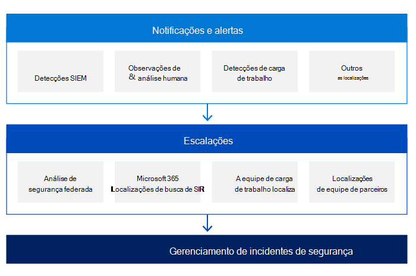

# Gerenciamento de incidentes de segurança da Microsoft: Detecção e análise

Para detectar atividades mal-intencionadas, cada um dos serviços online da Microsoft registra centralmente eventos de segurança e outros dados e executa várias técnicas analíticas para encontrar atividades anômalas ou suspeitas. Os arquivos de log são coletados de servidores de serviços online da Microsoft e dispositivos de infraestrutura e armazenados em bancos de dados centrais e consolidados.

A Microsoft assume uma abordagem baseada em risco para detectar atividades mal-intencionadas. Usamos dados de incidentes e inteligência contra ameaças para definir e priorizar nossas detecções.

Empregar uma equipe de pessoas altamente experientes, proficientes e qualificadas é um dos pilares mais importantes para o sucesso na fase de detecção e análise. A Microsoft emprega várias equipes de serviço que incluem funcionários com competências em todos os componentes da pilha, incluindo a rede, roteadores, firewalls, balanceadores de carga, sistemas operacionais e aplicativos.

Os mecanismos de detecção de segurança nos serviços online da Microsoft também incluem notificações e alertas iniciados por fontes diferentes. As equipes de resposta de segurança dos serviços online da Microsoft são os principais orquestradores do processo de escalonamento de incidentes de segurança. Essas equipes recebem todas as escalações e são responsáveis por analisar e confirmar a validade do incidente de segurança.

Um dos principais pilares da detecção é a notificação:

- Cada equipe de serviço é responsável por registrar qualquer ação ou evento dentro do serviço com base nos requisitos da equipe de segurança do serviço online. Todos os logs criados pelas diferentes equipes de serviço são processados por uma solução SIEM (Gerenciamento de Informações de Segurança e Eventos) com regras de segurança e detecção predefinidos. Essas regras evoluem com base nas recomendações da equipe de segurança, em informações aprendidas de incidentes de segurança anteriores, para determinar se há qualquer atividade suspeita ou mal-intencionada.
- Se um cliente determinar que um incidente de segurança está em andamento, ele poderá abrir um caso de suporte com a Microsoft, que é atribuído à equipe de comunicações da Microsoft e transformado em uma escalada para todas as equipes apropriadas.

As equipes de serviço do Azure, Dynamics 365 e Microsoft 365 também usam a inteligência obtida na análise de tendência por meio do monitoramento de segurança e do registro em log para detectar anormalidades nos sistemas de informações dos serviços online da Microsoft que podem indicar um ataque ou um incidente de segurança. Os sistemas de serviços online da Microsoft agregam a saída desses logs no ambiente de produção em servidores de log centralizados. Nesses servidores de registro em log centralizado, os logs são examinados para detectar tendências em todo o ambiente de produção. Os dados agregados nos servidores centralizados são transmitidos com segurança para um serviço de registro em log para consulta avançada, construção de painel e detecção de atividade anômala e mal-intencionada. O serviço também usa aprendizado de máquina para detectar anomalias com a saída de log.

Durante a fase de escalonamento e dependendo da natureza do incidente de segurança, as equipes de resposta de segurança podem envolver um ou mais especialistas em assuntos de várias equipes da Microsoft:

- Equipe de Segurança e Conformidade de Serviços Online
- Microsoft Threat Intelligence Center (MSTIC)
- Centro de Resposta de Segurança da Microsoft (MSRC)
- Assuntos Corporativos, Externos e Jurídicos (CELA)
- Segurança do Azure
- Microsoft 365 engenharia e outros.

Antes que ocorra uma escalada para qualquer equipe de resposta de segurança, a equipe de serviço é responsável por determinar e definir o nível de gravidade do incidente de segurança com base em critérios definidos, como:

- Privacidade
- Impacto
- Escopo
- Número de locatários afetados
- Região
- Serviço
- Detalhes do incidente
- Regulamentações específicas do mercado ou do setor do cliente.

A priorização de incidentes é determinada usando fatores distintos, incluindo, mas não se limitando ao impacto funcional do incidente, ao impacto informacional do incidente e à capacidade de recuperação do incidente.

Depois de receber uma escalada sobre um incidente de segurança, a equipe de segurança organiza uma equipe virtual (v-team) composta por membros da equipe de resposta de segurança do serviço online da Microsoft, equipes de serviço e a equipe de comunicação de incidentes. Em seguida, a equipe V deve confirmar a legitimidade do incidente de segurança e eliminar quaisquer falsos positivos. A precisão das informações fornecidas pelos indicadores determinados durante a fase de preparação é fundamental. Analisando essas informações por categoria de ataque vetorial, a equipe v pode determinar se o incidente de segurança é uma preocupação legítima.

No início da investigação, a equipe de resposta a incidentes de segurança registra todas as informações sobre o incidente de acordo com nossas políticas de gerenciamento de casos. À medida que o caso avança, acompanhamos as ações em andamento e acompanhamos os padrões de tratamento de evidências para coletar, reter e proteger esses dados durante todo o ciclo de vida do incidente.

Alguns exemplos dessas ações incluem:

- Um resumo, que é uma breve descrição do incidente e seu impacto potencial
- A gravidade e a prioridade do incidente, que são derivadas pela avaliação do impacto potencial
- Uma lista de todos os indicadores identificados que levaram à detecção do incidente
- Uma lista de incidentes relacionados
- Uma lista de todas as ações realizadas pela equipe v
- Qualquer evidência coletada, que também será preservada para análise pós-mortem e futuras investigações forenses
- Próximas etapas e ações recomendadas

Após a confirmação de incidentes de segurança, os principais objetivos da equipe de resposta de segurança e da equipe de serviço apropriada devem conter o ataque, proteger os serviços sob ataque e evitar um impacto global maior. Ao mesmo tempo, as equipes de engenharia apropriadas trabalham para determinar a causa raiz e preparar o primeiro plano de recuperação.

Na próxima fase, a equipe de resposta de segurança identifica os clientes afetados pelo incidente de segurança, se for o caso. O escopo de efeito pode levar algum tempo para determinar, com base na região, datacenter, serviço, farm de servidores, servidor e assim por diante. A lista de clientes afetados é compilada pela equipe de serviço e pela equipe de comunicações da Microsoft correspondente, que, em seguida, lida com o processo de notificação do cliente dentro das obrigações contratuais e de conformidade.

## Artigos relacionados

- [Gerenciamento de incidentes de segurança da Microsoft](assurance-security-incident-management.md)
- [Gerenciamento de incidentes de segurança da Microsoft: Preparação](assurance-sim-preparation.md)
- [Gerenciamento de incidentes de segurança da Microsoft: contenção, erradicação e recuperação](assurance-sim-containment-eradication-recovery.md)
- [Gerenciamento de incidentes de segurança da Microsoft: atividade pós-incidente](assurance-sim-post-incident-activity.md)
- [Como registrar um tíquete de suporte a eventos de segurança](/azure/security/fundamentals/event-support-ticket)
- [Notificação de Violação do Azure e do Dynamics 365 no GDPR](/compliance/regulatory/gdpr-breach-azure-dynamics)
