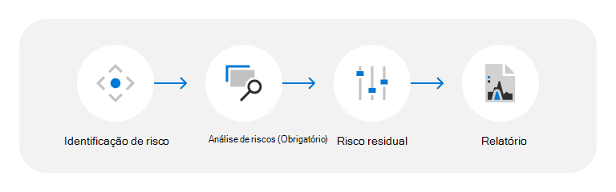

# Ameaça, vulnerabilidade e avaliação de riscos do datacenter

A Microsoft oferece mais de 200 serviços de nuvem aos clientes 24 horas por dia, 7 dias por semana, 365 dias por ano. Alguns exemplos são serviços empresariais, como Microsoft Azure, Microsoft Office 365, Microsoft Dynamics e serviços de consumidor, como Bing, MSN, Outlook.com, Skype e Xbox Live. Esses serviços são hospedados na infraestrutura de nuvem da Microsoft: datacenters distribuídos globalmente, nós de computação de borda e centros de operações de serviço e uma das maiores redes globais do mundo; com uma extensa pegada de fibra conectando-as a todos. Desde a abertura do nosso primeiro datacenter em 1989, investimos bilhões de dólares em nossa infraestrutura e continuamos focados em fornecer serviços on-line confiáveis, escalonáveis ​​e com segurança aprimorada, enquanto gerenciamos com eficiência operações e custos à medida que crescemos.

Os serviços de nuvem da Microsoft são criados com base na confiança e segurança, com foco na proteção de dados do cliente e aplicativos na nuvem com tecnologia, processos e criptografia de última geração. Os dados de cliente são armazenados em datacenters do geograficamente distribuídos e protegidos por camadas profundas de medidas lógicas e físicas de segurança. Os datacenters da Microsoft foram projetados e operados para proteger serviços e dados de danos por desastres naturais, ameaças ambientais ou acesso não autorizado.

## Metodologia de avaliação de riscos, vulnerabilidades e ameaças

O programa de Avaliação de Ameaças, Vulnerabilidades e Riscos (TVRA) ajuda você a entender como a Microsoft identifica e reduz o impacto das ameaças físicas e ambientais aos datacenters da Microsoft. A Microsoft está comprometida em atualizar continuamente suas avaliações de risco e metodologias para melhorias e à medida que as condições mudam. Como resultado, as análises e conclusões do TVRA estão sujeitas a alterações e os relatórios são considerados point-in-time.

A Microsoft facilita o processo de TRV seguindo estas etapas:

### Identificação de risco

AS TVRAs consideram uma ampla variedade de cenários de ameaça resultantes de riscos naturais e criados por humanos (incluindo acidentais). Os resultados variam de acordo com a localização do datacenter, o design, o escopo dos serviços e outros fatores. O TVRA seleciona os cenários de ameaça a destacar no documento TVRA com base nos requisitos do cliente, uma avaliação independente do país, da cidade e do site do ambiente de risco fornecido por informações de risco de terceiros e de terceiros. Para regiões que têm vários datacenters, as classificações de TVRA são agregadas para garantir uma visão holística das ameaças físicas e ambientais, vulnerabilidades e riscos para os locais que estão sendo avaliados.

Os tipos de cenários de ameaças avaliados em TVRAs do datacenter incluem:

- **Ameaças externas**: incidentes resultantes de atividades humanas intencionais ou acidentais externas. Por exemplo, desordem civil, terrorismo, atividade criminosa, roubo externo, dispositivos explosivos improvisados, ataques armados, incêndios, entrada não autorizada e colisões de aeronaves.
- **Ameaças internas**: incidentes resultantes de atividades humanas internas intencionais ou acidentais. Por exemplo, roubo interno e antirroubo.
- **Riscos naturais**: um processo natural ou um fenômeno que pode afetar negativamente os datacenters. Por exemplo, tempestades lunares, inundações, inundações, inundações, acidentes, terremotos, terremotos, atividade de terremotos e tempestades graves com raios, picos, fortes ou chuva intensa.
- **Ameaças ambientais**: condições ambientais que podem afetar negativamente os datacenters. Por exemplo, estresse por água, estresse por calor e pandemias.

### Análise de risco

As ameaças são avaliadas com base em uma avaliação de seu risco inerente; o risco inerente é calculado como uma função de impacto inerente de uma ameaça e probabilidade inerente da ocorrência de ameaça na ausência de ações e controles de gerenciamento. Essas avaliações são informadas pelos comentários internos do SME (especialista no assunto) e pelo uso de índices de risco externo.

### Risco residual

O risco residual é determinado como uma medida dos níveis de risco restantes após a consideração da eficácia do controle. A eficácia do controle é avaliada como uma medida das ações e controles de gerenciamento atuais projetados para evitar ou detectar ameaças enquanto avalia a probabilidade de que os controles tenham o efeito desejado conforme projetado e implementado. Essas avaliações são informadas por uma agregação de comentários de especialistas internos sobre a eficácia do controle para os locais do datacenter abordados na TVRA.

### Relatório

Depois que a avaliação é concluída, um relatório TVRA é gerado para aprovação de gerenciamento e para dar suporte aos nossos esforços gerais relacionados ao gerenciamento de riscos.

## Recursos

- [Infraestrutura Global do Azure](https://www.microsoft.com/datacenters)
