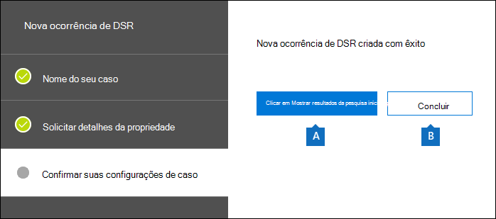
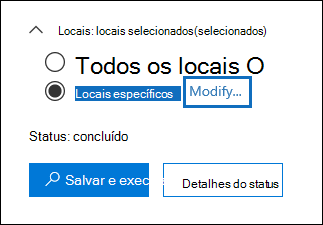
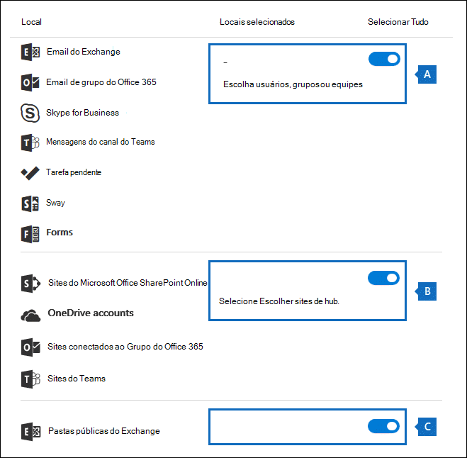
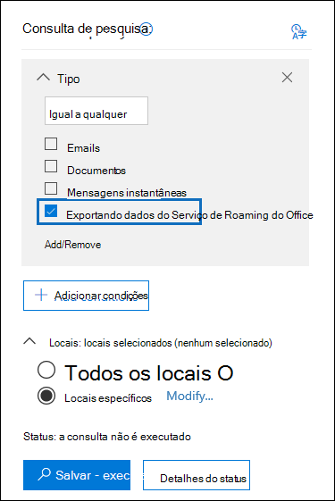
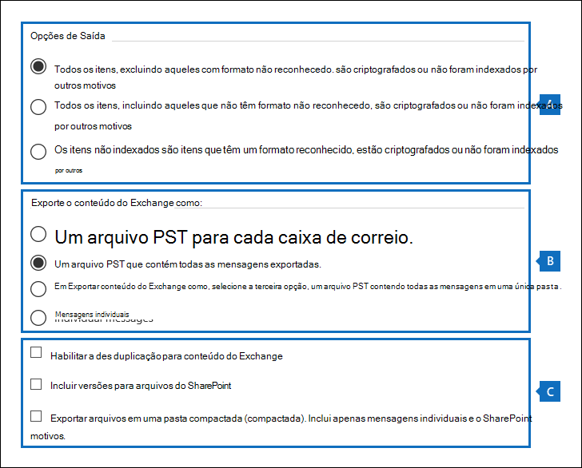

# <a name="manage-gdpr-data-subject-requests-with-the-dsr-case-tool-in-the-security--compliance-center"></a>Gerenciar solicitações do titular de dados do GDPR com a ferramenta de caso DSR no Centro de Conformidade e Segurança.

O GDPR (General Data Protection Regulation) da UE trata da proteção e da habilitação dos direitos de privacidade dos indivíduos dentro da União Europeia (UE). O GDPR oferece aos usuários da União Europeia (conhecidos como titulares de dados) o direito de acessar, recuperar, corrigir, apagar e restringir o processamento de seus dados pessoais. No GDPR, os dados pessoais significam todas as informações relacionadas a uma pessoa natural identificada ou identificável. Uma solicitação formal feita por um a pessoa à sua organização para executar uma ação em seus dados pessoais é chamada de Solicitação do Titular dos Dados, ou DSR. Para obter informações detalhadas sobre como responder a DSRs para dados no Office 365, consulte [Guia de Solicitação do Titular de Dados do Office 365](https://go.microsoft.com/fwlink/?linkid=871169 ).
  
Para gerenciar investigações em resposta a uma DSR enviada por uma pessoa em sua organização, você pode usar a ferramenta de caso DSR no Centro de Conformidade e Segurança para encontrar o conteúdo armazenado em:
  
- Qualquer caixa de correio do usuário na sua organização. Isso inclui conversas do Skype for Business e chats um-a-um no Microsoft Teams
    
- Todas as caixas de correio associadas a um Grupo do Microsoft 365 e todas as caixas de correio de equipe no Microsoft Teams
    
- Todos os sites do SharePoint Online e contas do OneDrive for Business em sua organização
    
- Todos os sites do Microsoft Teams e sites do Grupo do Microsoft 365 em sua organização
    
- Todas as pastas públicas no Exchange Online
    
Usando a ferramenta de caso DSR, você pode:
  
- Criar uma ocorrência separada para cada investigação de DSR.
    
- Controlar quem tem acesso ao caso de DSR adicionando pessoas como membros do caso; somente membros podem acessar o caso e apenas podem ver os respectivos casos na lista de casos na página de **casos de DSR** no Centro de Conformidade e Segurança. Além disso, você pode atribuir diferentes permissões a diferentes membros do mesmo caso. Por exemplo, você pode permitir que alguns membros exibam somente o caso e os resultados da pesquisa e permitir que outros membros criem pesquisas e exportem resultados da pesquisa. 
    
- Use a pesquisa local para pesquisar todo o conteúdo criado ou carregado por um titular de dados específico.
    
- Opcionalmente, revise a consulta de pesquisa integrada e refaça a pesquisa para restringir os resultados.
    
- Adicione outras pesquisas de conteúdo associadas ao caso de DSR. Isso inclui a criação de pesquisas que retornam itens parcialmente indexados e logs gerados pelo sistema por meio do Serviço de Roaming do Office.
    
- Exporte dados em resposta a um acesso DSR ou solicitação de exportação.
    
- Exclua casos quando o processo de investigação do DSR for concluído. Isso remove todas as pesquisas de conteúdo e exportará trabalhos associados ao caso.
    
Este é o processo de alto nível para usar a ferramenta de caso de DSR para gerenciar investigações de DSR:
  
[Etapa 1: atribua permissões de Descoberta Eletrônica para potenciais membros do caso](#step-1-assign-ediscovery-permissions-to-potential-case-members)

[Etapa 2: crie um caso de DSR e adicione membros](#step-2-create-a-dsr-case-and-add-members)

[Etapa 3: execute a consulta da pesquisa](#step-3-run-the-search-query)

[Etapa 4: exporte os dados](#step-4-export-the-data)

[(Opcional) Etapa 5: revise a consulta da pesquisa integrada](#optional-step-5-revise-the-built-in-search-query)

[Mais informações sobre como usar a ferramenta de caso de DSR](#more-information-about-using-the-dsr-case-tool)
  
> [!IMPORTANT]
> Nossas ferramentas podem ajudar os administradores a executar solicitações de exportação ou acesso ao DSR, permitindo que eles utilizem a funcionalidade de pesquisa e exportação integrada encontrada na ferramenta de caso de DSR. A ferramenta ajuda a facilitar um método de melhor esforço para exportar dados relevantes para uma solicitação de DSR enviada por um titular de dados. No entanto, é importante observar que os resultados da pesquisa podem variar de acordo com as ações tomadas pelo titular dos dados ou do administrador que possam afetar se um item seria considerado "dados pessoais" para fins de exportação. Por exemplo, se o titular dos dados tiver sido a última pessoa a modificar um arquivo que não criou, talvez o arquivo não seja retornado nos resultados da pesquisa. Da mesma forma, um administrador pode exportar dados sem incluir itens parcialmente indexados ou todas as versões de documentos do SharePoint. Portanto, as ferramentas fornecidas podem ajudar a facilitar o acesso e a exportação de solicitações de dados. No entanto, os resultados estão sujeitos a cenários de uso específicos pelo administrador e o titular de dados. 
  
## <a name="step-1-assign-ediscovery-permissions-to-potential-case-members"></a>Etapa 1: atribuir permissões de Descoberta Eletrônica para possíveis membros do caso.

Por padrão, um administrador global pode acessar a ferramenta de caso de DSR no Centro de Conformidade e Segurança. Por design, outros usuários, como um responsável pela privacidade de dados, um gerente de recursos humanos ou outras pessoas envolvidas em investigações de DSR não têm acesso à ferramenta de caso de DSR e terão que receber as permissões apropriadas para acessar a ferramenta. A maneira mais fácil de fazer isso é ir à página **Permissões** no Centro de Conformidade e Segurança e adicionar usuários ao grupo de função Gerenciador de Descoberta Eletrônica. Você também precisa atribuir essas permissões para poder adicioná-los como membros do caso de DSR criado na Etapa 2. 
  
Para obter instruções passo a passo, confira [Atribuir permissões de Descoberta Eletrônica no Centro de Conformidade e Segurança do Office 365](/microsoft-365/compliance/assign-ediscovery-permissions).
  
> [!NOTE]
> Por padrão, um administrador global (ou outros membros do grupo de função de Gerenciamento da Organização no Centro de Conformidade e Segurança não têm as permissões necessárias para exportar os resultados da Pesquisa de Conteúdo). Confira a Etapa 4 neste artigo. Para resolver isso, um administrador pode adicionar a si mesmos como membro do grupo de função Gerente de Descoberta Eletrônica. 
  
## <a name="step-2-create-a-dsr-case-and-add-members"></a>Etapa 2: crie um novo caso e adicione novos membros

A próxima etapa é criar um caso de DSR. Ao criar um caso, você pode optar por iniciar a pesquisa integrada ou pode criar o caso sem iniciar a pesquisa. O procedimento a seguir orienta você a criar o caso sem iniciar a pesquisa e, em seguida, mostra como adicionar membros ao caso.
  
1. Vá até [https://protection.office.com](https://protection.office.com) e entre usando uma conta corporativa ou de estudante. 
    
2. No Centro de Conformidade e Segurança, clique em **Privacidade de dados** \> **Solicitações do titular dos dados** e clique em  **Novo caso de DSR**.
    
3. Na página **Novo caso de DSR**, dê um nome ao caso, digite uma descrição opcional e clique em **Próximo**. O nome do caso deve ser exclusivo na sua organização.
    
    > [!TIP]
    > Considere adicionar o nome da pessoa que enviou a solicitação de DSR que você está investigando no nome e/ou na descrição do novo caso. Observe que somente os membros desse caso (e os Administradores de Descoberta Eletrônica) poderão ver o caso na lista de casos na página **Solicitações do titular dos dados**. 
  
4. Na página **Detalhes da solicitação**, em **Titular de dados (a pessoa que arquivou essa solicitação)**, selecione a pessoa para a qual você quer encontrar e exportar dados e clique em **Próximo**.
    
5. Na página **Confirmar as configurações de caso**, você pode alterar o nome e a descrição do caso e selecionar outro titular dos dados. Caso contrário, clique em **Salvar**.
    
    É exibida uma página que confirma que o novo caso de DSR foi criado.
    
    
  
    Neste ponto, você pode fazer uma de duas coisas:
    
    a. Clicar em **Mostrar resultados da pesquisa** inicia a pesquisa. Esta é a seleção padrão. A pesquisa integrada executada quando você seleciona essa opção e os resultados retornados são discutidos na Etapa 3.
    
    b. Clicar em **Concluir** fecha a nova ocorrência de DSR sem iniciar a pesquisa integrada. Quando você seleciona essa opção, o novo caso de DSR é exibido na página **Solicitações do titular dos dados**.
    
6. Clique em **Concluir** para que você possa acessar o novo caso de DSR e adicionar membros a ele. 
    
7. Na página **Solicitações do titular dos dados**, clique no nome do caso de DSR que você criou. 
    
8. Na página flutuante **Gerenciar este caso**, em **Gerenciar membros**, clique em **Adicionar**. 
    
    Em **Usuários**, é exibida uma lista de pessoas com as permissões de Descoberta Eletrônica apropriadas atribuídas. As pessoas para as quem você atribuiu permissões de Descoberta Eletrônica na Etapa 1 serão exibidas nessa lista. 
    
9. Selecione as pessoas para adicionar como membros do caso de DSR, clique em **Adicionar** e salve suas alterações.
    
    Você também pode adicionar grupos de funções como membros do caso de DSR clicando em **Adicionar** em **Gerenciar grupos de funções**. 
    
## <a name="step-3-run-the-search-query"></a>Etapa 3: execute a consulta de pesquisa

Depois de criar um caso de DSR e adicionar membros, a próxima etapa é executar a pesquisa integrada associada ao caso. Essa consulta de pesquisa padrão faz o seguinte:
  
- Pesquisa todas as caixas de correio na sua organização em busca de todos os itens de e-mail que foram enviados ou recebidos pelo titular dos dados. Isso é realizado usando a propriedade de e-mail  *Participantes*, que pesquisa o titular dos dados em todos os campos de pessoas em uma mensagem de e-mail. Esta propriedade retorna itens nos quais o titular dos dados está nos campos **De**, **Para**, **Cc** e **Cco**. As pastas públicas no Exchange Online também são pesquisadas em mensagens enviadas ou recebidas pelo titular dos dados. 
    
- Pesquisa documentos e itens criados ou carregados pelo titular de dados em todos os sites da sua organização. Isso é realizado usando as seguintes propriedades do site:
    
  - A  propriedade *Author*  retorna itens em que o titular dos dados está listado no campo autor em documentos do Office. Esse valor persiste, mesmo que o documento seja copiado e carregado por outra pessoa. 
    
  - A propriedade *CreatedBy*  retorna itens que foram criados ou carregados pelo titular dos dados. 
    
Esta é a aparência da consulta de palavra-chave para a pesquisa criada automaticamente quando você cria um caso de DSR.
  
```powershell
participants:"<email address>" OR author:"<display name>" OR createdby:"<display name>"
```

Por exemplo, se o nome do titular dos dados for Ina Leonte, a consulta de palavra-chave teria esta aparência:
  
```powershell
participants:"ina@contoso.com" OR author:"Ina Leonte" OR createdby:"Ina Leonte"
```

 **Para executar a pesquisa de dentro de um caso de DSR:**
  
1. No Centro de Conformidade e Segurança, clique em **Privacidade de dados** \> **Solicitações do titular dos dados** e clique em **Abrir** ao lado do caso de DSR criado na Etapa 2. 
    
    Clique na guia **Pesquisar** na parte superior da página e, em seguida, clique na caixa de seleção ao lado da pesquisa criada na hora em que você criou o caso de DSR. A pesquisa tem o mesmo nome do caso de DSR. 
    
2. Na página de pesquisa flutuante, clique em **Abrir consulta**.
    
    Quando você abre a consulta, a pesquisa é iniciada e será concluída em alguns instantes. 
    
3. Quando a pesquisa estiver concluída, clique em **Visualizar resultados** para visualizar os resultados da pesquisa. Para saber mais, consulte [Visualizar resultados da pesquisa](/microsoft-365/compliance/content-search#preview-search-results).
    
    > [!TIP]
    > Você também pode exibir as estatísticas de consulta de pesquisa para ver o número de itens de caixa de correio e de site retornados pela pesquisa e os principais locais de conteúdo que contêm itens que correspondem à consulta de pesquisa. Para saber mais, consulte [Exibir informações e estatísticas sobre uma pesquisa](/microsoft-365/compliance/content-search#view-information-and-statistics-about-a-search). 
  
Você pode editar a consulta de pesquisa integrada, alterar os locais de conteúdo que são pesquisados e, em seguida, executar a pesquisa novamente.  Consulte a [Etapa 5](#optional-step-5-revise-the-built-in-search-query) para obter mais informações. 
  
## <a name="step-4-export-the-data"></a>Etapa 4: exporte os dados

Depois de executar a pesquisa integrada, você pode exportar os resultados da pesquisa. Como alternativa, antes de exportar os dados, talvez você queira revisar a consulta para reduzir o número de resultados da pesquisa. Confira a Etapa 5 para saber mais sobre como restringir os resultados da pesquisa.
  
Quando você exporta os resultados da pesquisa, itens de caixa de correio podem ser baixados em arquivos PST ou como mensagens individuais. Ao exportar conteúdo de contas do SharePoint e do OneDrive, cópias de documentos nativos do Office e de outros documentos serão exportadas. Um arquivo de resultados que contém informações sobre cada item exportado está incluído nos resultados da pesquisa. Para obter informações mais detalhadas sobre como exportar, consulte [Resultados da Pesquisa de Conteúdo](/microsoft-365/compliance/export-search-results).
  
> [!NOTE]
> Por padrão, um administrador global (ou outros membros do grupo de função Gerenciamento da Organização no Centro de Conformidade e Segurança) não têm as permissões necessárias para exportar os resultados da Pesquisa de Conteúdo. Para resolver isso, um administrador pode adicionar a si mesmos como membro do grupo de função Gerente de Descoberta Eletrônica. 
  
Além disso, o computador que você usar para exportar o conteúdo deve atender aos seguintes requisitos de sistema:
  
- Versões de 32 e 64 bits do Windows 7 e versões posteriores
    
- Microsoft .NET Framework 4.7
    
- Um navegador com suporte:
    
  - Microsoft Edge
    
    Ou
    
  - Internet Explorer 10 e versões posteriores
    
    > [!NOTE]
    > A Microsoft não fabrica extensões ou complementos de terceiros para aplicativos ClickOnce. Não há suporte para a exportação de dados usando um navegador sem suporte com extensões ou complementos de terceiros. 
  
 **Para exportar dados da pesquisa integrada em um caso de DSR:**
  
1. No Centro de Conformidade e Segurança, clique em **Privacidade de dados** \> **Solicitações do titular dos dados** e clique em **Abrir** ao lado do caso de DSR do quais você deseja exportar dados. 
    
2. Clique na guia **Pesquisar** na parte superior da página e, em seguida, clique na caixa de seleção ao lado da pesquisa criada na hora em que você criou o caso de DSR. Ou clique em outra pesquisa para exportar os dados dessa pesquisa. 
    
3. Na página de pesquisa flutuante, clique no  **Mais** e selecione **Exportar resultados** na lista suspensa. 
    
4. Na página **Exportar resultados**, selecione as seguintes opções recomendadas para solicitações de exportação de DSR. 
    
    
  
    a. Em **Opções de saída**, selecione a primeira opção (**Todos os itens, excluindo aqueles que têm um formato não reconhecido, que são criptografados ou não foram indexados por outros motivos**) para exportar somente os itens indexados. O motivo pelo qual você não quer exportar itens parcialmente indexados da pesquisa integrada é porque os itens parcialmente indexados de outros usuários também serão exportados. Para exportar somente os itens parcialmente indexados para o titular dos dados, recomendamos que você crie uma pesquisa separada. Para saber mais, confira[Exportar itens parcialmente indexados](#exporting-partially-indexed-items) na seção "Mais informações sobre como usar a ferramenta de caso DSR".
    
    b. Em **Exportar conteúdo do Exchange como**, selecione a terceira opção, **um arquivo PST contendo todas as mensagens em uma única pasta**. Como alguns dos resultados podem ser para itens originados na caixa de correio de outro usuário, essa opção lista apenas o item em uma única pasta sem indicar a caixa de correio real e é a melhor opção para usar quando você duplicar os resultados, conforme recomendado no próximo item. Essa opção também permite que o titular dos dados revisem itens em ordem cronológica (os itens são classificados por data de envio) sem precisar navegar pela estrutura da pasta da caixa de correio original para cada item.
    
    c. Selecione a opção **Habilitar a des-duplicação** para excluir mensagens de e-mail duplicadas. Recomendamos essa opção porque a pesquisa integrada pesquisa todas as caixas de correio na sua organização. Portanto, se várias cópias da mesma mensagem são encontradas nas caixas de correio que foram pesquisadas, essa opção significa que apenas uma cópia de uma mensagem será exportada. Essa opção, em conjunto, exportará mensagens em um arquivo PST em uma única pasta, resulta na melhor experiência de usuário para solicitações de exportação de DSR. O relatório de exportação Results.csv lista todos os locais em que foram encontradas mensagens duplicadas.
    
    Opcionalmente, você pode selecionar a opção **Incluir versões para documentos do SharePoint** para exportar todas as versões de documentos do SharePoint e do OneDrive. Isso requer que o versionamento seja ligado para bibliotecas de documentos. Essa opção ajuda a garantir que todos os dados relevantes serão exportados.
    
5. Depois de escolher as configurações de exportação, clique em **Exportar**.
    
    Os resultados da pesquisa são preparados para download, o que significa que são carregados para a área de Armazenamento do Azure na nuvem da Microsoft. As próximas etapas mostram como baixar esses dados para o computador local.
    
6. Clique na guia **Exportar** para exibir o trabalho de exportação que você criou. Trabalhos de exportação têm o mesmo nome da pesquisa correspondente **_Export** anexadas ao final do nome da pesquisa. 
    
7. Clique no trabalho de exportação que você acabou de criar para exibir a página de exportação. Esta página mostra informações sobre a pesquisa, como o tamanho e o número total de itens a serem exportados e a porcentagem dos itens que foram transferidos para uma área de armazenamento do Azure. Clique em **Atualizar** para atualizar as informações de status de carregamento. 
    
8. Em **Chave de exportação**, clique em **Copiar para a área de transferência**. Você usará essa chave na etapa 11 para baixar os resultados da pesquisa.
    
9. Clique no  **Baixar resultados** na parte superior da página flutuante exportar. 
    
10. Na janela pop-up na parte inferior da página, clique em **Abrir** para abrir a **Ferramenta de Exportação de Descoberta Eletrônica**. A **Ferramenta de Exportação de Descoberta Eletrônica** será instalada na primeira vez que você baixar os resultados da pesquisa. 
    
11. Na **Ferramenta de Exportação de Descoberta Eletrônica**, cole a chave de exportação que você copiou na etapa 8.
    
12. Clique em **Procurar** para especificar o local onde deseja baixar os arquivos de resultado da pesquisa. 
    
    > [!NOTE]
    > Devido à grande quantidade de atividade de disco (lê e grava), você deve baixar os resultados da pesquisa para uma unidade de disco local; não as baixe para uma unidade de rede mapeada ou para outro local de rede. 
  
13. Clique em **Iniciar** para baixar os resultados da pesquisa em seu computador. 
    
    A **Ferramenta de Exportação de Descoberta Eletrônica** exibe informações de status sobre o processo de exportação, incluindo uma estimativa do número (e tamanho) dos itens restantes a serem baixados. Quando o processo de exportação estiver concluído, você poderá acessar os arquivos no local onde eles foram baixados. Para saber mais sobre os relatórios incluídos quando você baixa resultados da Pesquisa de Conteúdo, confira a seção [Mais informações](/microsoft-365/compliance/export-search-results#more-information) em "Exportar resultados da Pesquisa de Conteúdo". 
    
Depois que os dados são exportados, os resultados da pesquisa e os relatórios de exportação estão localizados em uma pasta que tem o mesmo nome do caso de DSR. Os arquivos PST que contêm itens de caixa de correio estão localizados em uma subpasta chamada **Exchange**. Documentos e outros itens de sites estão localizados em uma subpasta chamada **SharePoint**. 
  
## <a name="optional-step-5-revise-the-built-in-search-query"></a>(Opcional) Etapa 5: revise a consulta de pesquisa integrada

Depois de executar a pesquisa integrada, você pode revisá-la para restringir o escopo a fim de retornar menos resultados de pesquisa. Você pode fazer isso adicionando condições à consulta. Observe que as condições estão logicamente associadas à consulta de palavra-chave pelo operador **AND**. Isso significa que, para serem retornados nos resultados da pesquisa, os itens devem atender à consulta de palavra-chave e às condições que você adicionar. É assim que as condições ajudam a restringir os resultados. Se você adicionar duas ou mais condições exclusivas a uma consulta de pesquisa (condições que especificam propriedades diferentes), essas condições serão logicamente conectadas pelo operador **AND**. Isso significa que apenas os itens que atenderem a todas as condições (além de qualquer consulta de palavra-chave) serão retornados. Se você adicionar vários valores (separados por vírgulas ou ponto-e-vírgula) a uma única condição, os valores serão conectados pelo operador **OR**. Isso significa que os itens serão retornados se contiverem qualquer um dos valores especificados para a propriedade na condição. 
  
Aqui estão alguns exemplos das condições que você pode adicionar à consulta de pesquisa dentro de um caso de DSR. O nome da propriedade real usada em uma consulta de pesquisa é exibido entre parênteses.
  
- **File type ( `filetype`)**: especifica a extensão de um documento ou arquivo. Use essa condição para pesquisar documentos e arquivos criados por aplicativos específicos do Office, como o Word, o Excel e o OneNote. 
    
- **Message type ( `kind`)**: especifica o tipo de item de e-mail a ser pesquisado. Por exemplo, você pode usar a sintaxe  `kind:email OR kind:im` para retornar somente mensagens de e-mail e conversas do Skype for Business ou chats um-a-um no Microsoft Teams. 
    
- **Compliance tag (`compliancetag`)**: especifica um rótulo atribuído a uma mensagem de e-mail ou a um documento. Essa condição retorna itens classificados com um rótulo específico. Os rótulos são usados para classificar e-mails e documentos para governança de dados e impor regras de retenção com base na classificação definida pelo rótulo. Essa é uma condição útil para investigações de DSR porque sua organização pode estar usando rótulos para classificar conteúdo relacionado à privacidade de dados ou que contém dados pessoais ou informações confidenciais. Para o valor dessa condição, use o nome do rótulo completo ou a primeira parte do nome do rótulo com um caractere curinga. Para obter mais informações, consulte [Saiba mais sobre políticas e rótulos de retenção no Office 365](/microsoft-365/compliance/retention).
    
Para uma lista e uma descrição de todas as condições disponíveis na ferramenta de caso de DSR, confira [Condições de pesquisa](/microsoft-365/compliance/keyword-queries-and-search-conditions#search-conditions) no artigo "Consultas de palavra-chave e condições de pesquisa para Pesquisa de Conteúdo". 
  
### <a name="changing-the-content-locations-that-are-searched"></a>Alterando os locais de conteúdo pesquisados

Além de revisar a pesquisa local para um caso de DSR, você também pode alterar os locais de conteúdo que são pesquisados. Conforme explicado anteriormente, a pesquisa integrada pesquisa todas as caixas de correio e sites na organização, bem como as pastas públicas do Exchange Online. Por exemplo, você pode restringir a pesquisa para pesquisar somente a caixa de correio do titular de dados e a conta do OneDrive e sites do SharePoint selecionados. Se optar por pesquisar sites específicos, você terá que adicionar cada site que você deseja pesquisar.
  
Para modificar os locais de conteúdo para pesquisar:
  
1. Abra a pesquisa integrada para a qual você deseja alterar os locais de conteúdo.
    
2. Na consulta de pesquisa, em **Locais**, clique em **Modificar** ao lado da opção **Locais específicos**. 
    
    
  
    A página flutuante **Modificar locais** será exibida. Aqui está uma descrição dos locais de conteúdo na pesquisa integrada e algumas informações sobre como modificar os locais que são pesquisados. 
    
    
  
    a. O botão de alternância em **Selecionar tudo** na seção de caixa de correio na parte superior da página flutuante está secionado, o que indica que todas as caixas de correio serão pesquisadas. Para restringir o escopo da pesquisa, clique no botão de alternância para desmarcá-lo e clique em **Escolher usuários, grupos ou equipes** e escolha caixas de correio específicas para pesquisar.
    
    b. O botão de alternância **Selecionar tudo** na seção de sites no meio da página flutuante está selecionado, o que indica que todos os sites são pesquisados. Para restringir a pesquisa a sites selecionados, desmarque o botão de alternância e clique em **Escolher sites**. É preciso adicionar cada site específico que você deseja pesquisar, incluindo a conta do OneDrive do titular dos dados.
    
    c. A botão de alternância na seção de pastas públicas do Exchange está selecionada, o que significa que todas as pastas públicas do Exchange serão pesquisadas. Você só pode pesquisar todas as pastas públicas do Exchange ou nenhuma delas. Você não pode pastas específicas para pesquisar.
    
3. Se você modificar os locais de conteúdo na pesquisa integrada, clique em **Salvar &amp; executar** para reiniciar a pesquisa. 

> [!NOTE]
> Quando você pesquisa todos os locais de caixa de correio ou apenas caixas de correio específicas, os dados de outros aplicativos do Office 365 salvos nas caixas de correio do usuário são incluídos quando você exportar os resultados de uma pesquisa de conteúdo. Esses dados não serão incluídos nos resultados de pesquisa estimados e não estarão disponíveis para visualização. Eles serão incluídos na exportação e no download dos resultados da pesquisa. Para saber mais sobre os aplicativos que armazenam dados na caixa de correio do usuário, confira [Conteúdo armazenado nas caixas de correio do Exchange Online](/microsoft-365/compliance/what-is-stored-in-exo-mailbox).
  
## <a name="more-information-about-using-the-dsr-case-tool"></a>Mais informações sobre como usar a ferramenta de caso de DSR

As seções a seguir contêm mais informações sobre como usar a ferramenta de caso de DSR para responder a solicitações de exportação de DSR.
  
[Exportando dados do Serviço de Roaming do Office](#exporting-data-from-the-office-roaming-service)

[Exportando itens parcialmente indexados](#exporting-partially-indexed-items)

[Pesquisando e exportando dados do Microsoft Teams e de Grupos do Microsoft 365](#searching-and-exporting-data-from-microsoft-teams-and-microsoft-365-groups)

[Pesquisando pastas públicas do Exchange](#searching-exchange-public-folders)
  
### <a name="exporting-data-from-the-office-roaming-service"></a>Exportando dados do Serviço de Roaming do Office

Você pode usar a ferramenta de caso de DSR para pesquisar e exportar dados de uso gerados pelo Serviço de Roaming do Office. O Roaming é um serviço que armazena configurações relacionadas ao Office, como o tema do Office, dicionário personalizado, configurações de idioma, modo do desenvolvedor e correção automática. 
    
Os dados do serviço de Roaming do Office são armazenados na caixa de correio de um titular de dados em uma pasta oculta localizada em uma subárvore de caixas de correio do Exchange Online não interpessoais (não IPM). Isso significa que os dados ficam ocultos do ponto de vista do usuário quando eles usam o Outlook ou outros clientes de e-mail para acessar suas caixas de correio. Para saber mais sobre pastas ocultas, consulte [Pastas Ocultas MAPI](https://go.microsoft.com/fwlink/?linkid=872758).
  
Você pode criar uma pesquisa de conteúdo separada (e associá-la a um caso de DSR) que retorne os dados de uso do Serviço de Roaming do Office na caixa de correio do titular dos dados. Esses dados não estão incluídos nas estatísticas de pesquisa e não estarão disponíveis para visualização. Mas você pode exportá-los e, em seguida, dar ao titular dos dados em resposta a uma solicitação de exportação de DSR.
  
Quando você exporta dados do Serviço de Roaming do Office, os dados são salvos em uma pasta separada localizada na pasta **ApplicationDataRoot**, que está abaixo de uma pasta que tem o nome com o endereço de e-mail do titular dos dados. Esses dados são exportados como arquivos JSON, que são arquivos de texto legíveis por humanos similares a arquivos XML ou TXT, que são anexados a mensagens de e-mail. Atualmente, esta pasta é nomeada com o identificador global exclusivo (GUID): **1caee58f-eb14-4a6b-9339-1fe2ddf6692b**. Em versões futuras da ferramenta de caso de DSR, o GUID será substituído pelo nome do aplicativo real. 

   
 **Para pesquisar e exportar dados do Serviço de Roaming do Office:**
  
1. No Centro de Conformidade e Segurança, clique em **Privacidade de dados** \> **Solicitações do titular dos dados** e clique em **Abrir** ao lado do caso de DSR do titular de dados para o qual você deseja exportar dados de uso. 
    
2. Clique na guia **Pesquisar** na parte superior da página e clique em  **Pesquisa Guiada**.
    
3. Clique em **Cancelar** na página **Nomeie sua pesquisa**. 
    
4. Em **Consulta de pesquisa**, na condição **Type**, marque a caixa de seleção ao lado de **Serviço de roaming do Office**. 
    
    
  
    A condição **Type** (que são classes de mensagens de e-mail) deve ser o único item na consulta de pesquisa. Você pode excluir a caixa **Palavras-chave** ou deixá-la em branco. 
    
5. Em **Locais**, certifique-se de que **Locais específicos** esteja selecionado e clique em **Modificar**.
    
6. Na parte superior da página flutuante **Modificar locais** (a seção caixa de correio), clique em **Escolher usuários, grupos ou equipes**.
    
7. Na página **Editar locais**, clique em **Escolher usuários, grupos ou equipes**, escolha a caixa de correio do titular dos dados e salve sua seleção. 
    
8. Clique em **Salvar e executar**, nomeie a pesquisa e salve-a.
    
    A pesquisa é iniciada.
    
 **Para exportar dados do Serviço de Roaming do Office:**
  
1. Quando a pesquisa que você criou na etapa anterior estiver concluída, clique na guia **Pesquisar** na parte superior da página e clique na caixa de seleção ao lado da pesquisa. Talvez seja preciso clicar em  **Atualizar** para exibir a pesquisa. 
    
2. Na página de pesquisa flutuante, clique no  **Mais** e selecione **Exportar resultados** na lista suspensa. 
    
3. Na página **Exportar resultados**, selecione as opções recomendadas para exportar os dados de uso. 
    
    
  
    a. Em **Opções de saída**, selecione a primeira opção (**Todos os itens, excluindo aqueles que têm um formato não reconhecido, que são criptografados ou não foram indexados por outros motivos**) para exportar somente os itens indexados.
    
    b. Em **Exportar conteúdo do Exchange como**, selecione a segunda opção **um arquivo PST contendo todas as mensagens**.
    
    c. Deixe as opções de exportação restantes desmarcadas.
    
4. Depois de escolher as configurações de exportação, clique em **Exportar**.
    
    Os resultados da pesquisa são preparados para download, o que significa que estão sendo carregados para a área de armazenamento do Azure na nuvem da Microsoft. As próximas etapas mostram como baixar esses dados para o computador local.
    
5. Clique na guia **Exportar** para exibir o trabalho de exportação que você criou. Os trabalhos de exportação têm o mesmo nome da pesquisa correspondente **_Export** anexadas ao final do nome da pesquisa. 
    
6. Clique no trabalho de exportação que você acabou de criar para exibir a página de exportação. 
    
7. Em **Chave de exportação**, clique em **Copiar para a área de transferência**. Você usará essa chave na etapa 10 para baixar os resultados da pesquisa.
    
8. Clique no  **Baixar resultados** na parte superior da página flutuante exportar. 
    
9. Na janela pop-up na parte inferior da página, clique em **Abrir** para abrir a **Ferramenta de Exportação de Descoberta Eletrônica**. A **Ferramenta de Exportação de Descoberta Eletrônica** será instalada na primeira vez que você baixar os resultados da pesquisa. 
    
10. Na **Ferramenta de Exportação de Descoberta Eletrônica**, cole na caixa apropriada a chave de exportação que você copiou na etapa 7.
    
11. Clique em **Procurar** para especificar o local onde deseja baixar os arquivos de resultado da pesquisa. 
    
    > [!NOTE]
    > Devido à grande quantidade de atividade de disco (lê e grava), você deve baixar os resultados da pesquisa para uma unidade de disco local; não as baixe para uma unidade de rede mapeada ou para outro local de rede. 
  
12. Clique em **Iniciar** para baixar os resultados da pesquisa em seu computador. 
    
    A **Ferramenta de Exportação de Descoberta Eletrônica** exibe informações de status sobre o processo de exportação, incluindo uma estimativa do número (e tamanho) dos itens restantes a serem baixados. Quando o processo de exportação estiver concluído, você poderá abrir o arquivo PST do Exchange no Outlook e, em seguida, ir para a pasta **ApplicationDataRoot** para acessar a subpasta para o serviço de Roaming. 
    
    Como já explicado, os arquivos JSON que contêm dados de uso são anexados às mensagens. Para exibir um arquivo JSON, clique em uma mensagem e abra o arquivo JSON anexado. 
  
### <a name="exporting-partially-indexed-items"></a>Exportando itens parcialmente indexados

Recomendamos que você não exporte itens parcialmente indexados (também chamados de itens não indexados) da pesquisa criada quando você cria um caso de DSR. Isso porque os resultados da pesquisa provavelmente incluirão itens parcialmente indexados para outros usuários em sua organização e não apenas os itens parcialmente indexados para o titular dos dados). Em vez disso, recomendamos que você crie uma Pesquisa de Conteúdo separada associada ao caso de DSR que foi projetada para exportar somente os itens parcialmente indexados relacionados ao titular dos dados. 
  
Este é um processo de alto nível para exportar itens parcialmente indexados. Depois que eles são exportados, você pode revisá-los para determinar se um item está responsivo a um acesso de DSR ou a uma solicitação de exportação.
  
1. Abra o caso de DSR e crie uma pesquisa na página **Pesquisar**. 
    
2. Use os seguintes critérios para configurar a consulta de pesquisa e os locais de conteúdo a fim de pesquisar:
    
    - Use uma consulta de palavra-chave vazia/em branco. Isso retorna todos os itens nos locais de conteúdo que são pesquisados.
    
    - Pesquise somente a caixa de correio do Exchange Online do titular de dados e sua conta do OneDrive.
    
3. Depois de executar a pesquisa e ela ser concluída, você pode exportar e baixar os resultados da pesquisa (conforme descrito na [Etapa 4](#step-4-export-the-data)). Use as configurações a seguir para exportar itens parcialmente indexados. 
    
    - Em **Opções de saída**, selecione a terceira opção (**Somente os itens que têm um formato não criptografado, são criptografados ou não foram indexados por outros motivos**) para exportar somente itens parcialmente indexados.
    
    - Em **exportar conteúdo do Exchange como**, você pode selecionar qualquer opção com base nas suas preferências. 
    
    - Selecionar a opção **Incluir versões para documentos do SharePoint** exportará versões de documentos se uma versão estiver parcialmente indexada. 
    
Para obter mais informações sobre itens parcialmente indexados, consulte: 
  
- [Itens parcialmente indexados na Pesquisa de Conteúdo do Office 365](/microsoft-365/compliance/partially-indexed-items-in-content-search)

- [Exportando itens parcialmente indexados](/microsoft-365/compliance/export-search-results#exporting-partially-indexed-items)

### <a name="searching-and-exporting-data-from-microsoft-teams-and-microsoft-365-groups"></a>Pesquisando e exportando dados do Microsoft Teams e de Grupos do Microsoft 365

As conversas que fazem parte da lista de Chat do Microsoft Teams (chamadas chats de equipe ou chats um-a-um) são armazenadas na caixa de correio do Exchange Online dos usuários que participam dos chats. Além disso, os arquivos que uma pessoa compartilha em um chat um-a-um são armazenados na conta do OneDrive da pessoa que compartilha o arquivo. Como a pesquisa integrada pesquisa todas as caixas de correio e contas do OneDrive na organização, os chats da equipe e os documentos compartilhados em uma sessão de chat (que o titular dos dados criou ou carregou) são retornados pela pesquisa local em um caso de DSR.
  
Como alternativa, conversas que fazem parte de um canal do Teams (também chamadas de mensagens de canal) são armazenadas na caixa de correio associada a uma equipe. Esses tipos de conversas das quais o titular de dados participou também são retornadas pela pesquisa integrada porque todas as caixas de correio associadas ao Teams são pesquisadas. Além disso, os arquivos que um titular de dados compartilha em um canal do Teams são armazenados no site do SharePoint da equipe. Os arquivos criados ou carregados pelo titular dos dados são retornados pela pesquisa inserida em um caso de DSR, pois os sites associados ao Teams são incluídos na pesquisa.
  
Da mesma forma, caixas de correio e sites do SharePoint que correspondem a um Grupo do Microsoft 365 também estão incluídos na pesquisa inserida. Isso significa que as mensagens de e-mail enviadas ou recebidas pelo titular dos dados e arquivos criados ou carregados pelo titular dos dados são retornadas. 
  
Para saber mais sobre como usar a Pesquisa de Conteúdo para pesquisar itens no Microsoft Teams e nos Grupos do Microsoft 365 ou para ver como obter uma lista de membros, confira a seção "Pesquisando grupos do Microsoft Teams e do Microsoft 365" em [Pesquisa de Conteúdo no Microsoft 365](/microsoft-365/compliance/content-search#searching-microsoft-teams-and-microsoft-365-groups). 
  
### <a name="searching-exchange-public-folders"></a>Pesquisando pastas públicas do Exchange

A pesquisa integrada em um caso de DSR retornará apenas as mensagens de e-mail enviadas pelo titular de dados para uma pasta pública habilitada para e-mail ou mensagens que outra pessoa tenha enviado para uma pasta pública e tenha também copiado o titular dos dados. Ela não retorna mensagens que o titular de dados tenha postado em uma pasta pública. Para pesquisar itens que o titular de dados tenha postado em uma pasta pública, você pode criar uma Pesquisa de Conteúdo separada que pesquise por qualquer item postado em uma pasta pública pelo titular dos dados.
  
Aqui está um processo de alto nível para procurar itens que os titular dos dados tenha postado em uma pasta pública. 
  
1. Abra o caso de DSR e crie uma pesquisa na página **Pesquisar**. 
    
2. Use os seguintes critérios para configurar a consulta de pesquisa e os locais de conteúdo a fim de pesquisar:
    
  - Na caixa **Palavras-chave**, use a seguinte consulta: 
    
    ```powershell
    itemclass:ipm.post AND "<email address of the data subject>"
    ```

  - Pesquise todas as pastas públicas do Exchange
    
  - Depois de executar a pesquisa e ela ser concluída, você pode exportar e baixar os resultados da pesquisa (conforme descrito na [Etapa 4](#step-4-export-the-data)). Use as configurações a seguir para exportar itens parcialmente indexados. 
