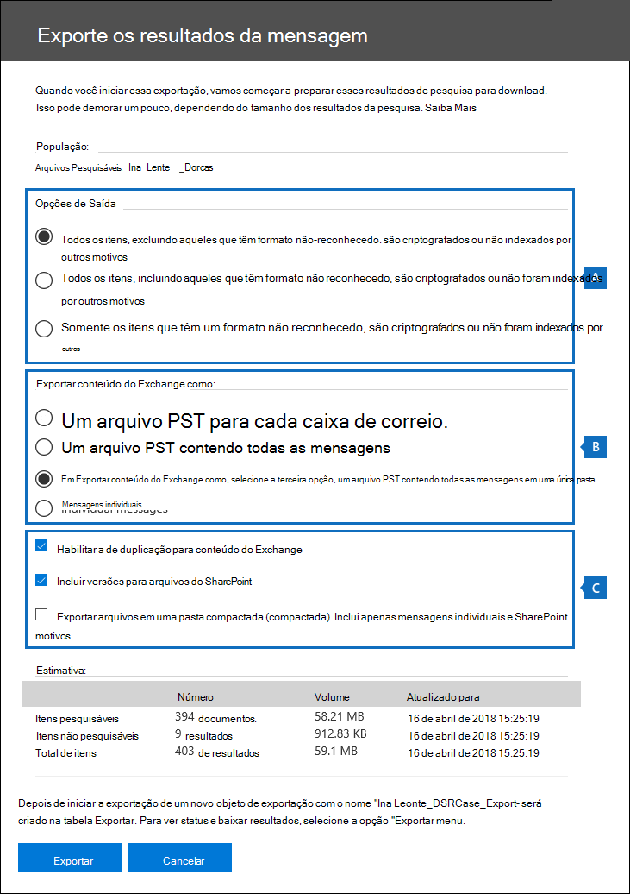
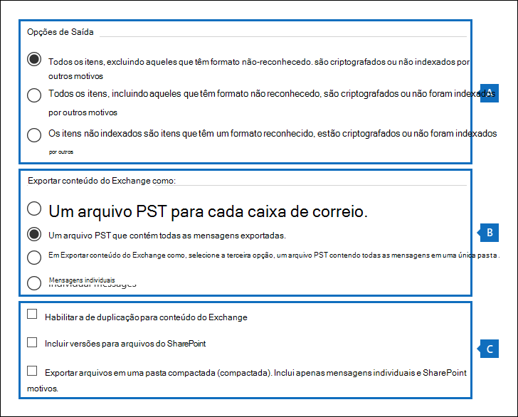

# <a name="manage-gdpr-data-subject-requests-with-the-dsr-case-tool-in-the-security--compliance-center"></a>Gerenciar solicitações de assunto de dados RGPD com a ferramenta de ocorrência de DSR no Centro de Conformidade & Segurança

O RGPD (Regulamento Geral sobre a Proteção de Dados) da UE trata da proteção e da habilitação dos direitos de privacidade das pessoas dentro da União Europeia (UE). O RGPD concede às pessoas na União Europeia (conhecidas como entidades de dados) o direito de acessar, recuperar, corrigir, apagar e restringir o processamento de seus dados pessoais. De acordo com o RGPD, os dados pessoais significam qualquer informação relacionada a uma pessoa física identificada ou identificável. Uma solicitação formal de uma pessoa à sua organização para tomar uma ação em seus dados pessoais é chamada de Solicitação de Entidade de Dados ou DSR. Para obter informações detalhadas sobre como responder às DSRs para dados no Office 365, consulte o Guia de Solicitação de Assunto de Dados do [Office 365.](https://go.microsoft.com/fwlink/?linkid=871169 )
  
Para gerenciar investigações em resposta a uma DSR enviada por uma pessoa em sua organização, você pode usar a ferramenta de ocorrência de DS & R no Centro de Conformidade e Segurança para encontrar conteúdo armazenado em:
  
- Qualquer caixa de correio de usuário em sua organização. Isso inclui conversas do Skype for Business e chats um-para-um no Microsoft Teams
    
- Todas as caixas de correio associadas a um Grupo do Microsoft 365 e a todas as caixas de correio de equipe no Microsoft Teams
    
- Todos os sites do SharePoint Online e contas do OneDrive for Business em sua organização
    
- Todos os sites do Teams e sites de grupo do Microsoft 365 em sua organização
    
- Todas as pastas públicas no Exchange Online
    
Usando a ferramenta de ocorrência de DSR, você pode:
  
- Criar uma ocorrência separada para cada investigação de DSR.
    
- Controlar quem tem acesso à ocorrência de DSR adicionando pessoas como membros da ocorrência; somente os membros podem acessar a ocorrência e só podem ver seus casos na lista de casos na página de casos **de DSR** no Centro de Conformidade & segurança. Além disso, você pode atribuir permissões diferentes a diferentes membros da mesma ocorrência. Por exemplo, você pode permitir que alguns membros exigam apenas a ocorrência e os resultados da pesquisa e permitir que outros membros criem pesquisas e exportem resultados de pesquisa. 
    
- Use a pesquisa embutida para pesquisar todo o conteúdo criado ou carregado por um assunto de dados específico.
    
- Opcionalmente, revise a consulta de pesquisa e reruncar a pesquisa para restringir os resultados da pesquisa.
    
- Adicione outras pesquisas de conteúdo associadas à ocorrência de DSR. Isso inclui a criação de pesquisas que retornam itens parcialmente indexados e logs gerados pelo sistema do Serviço de Roaming do Office.
    
- Exportar dados em resposta a uma solicitação de acesso ou exportação de DSR.
    
- Excluir ocorrências quando o processo de investigação quando o processo de investigação de DSR é concluído. Isso removerá todas as pesquisas e exportará trabalhos associados à ocorrência.
    
Aqui está o processo de alto nível para usar a ferramenta de ocorrência de DSR para gerenciar investigações de DSR:
  
[Step 1: Assign eDiscovery permissions to potential case members](#step-1-assign-ediscovery-permissions-to-potential-case-members)

[Etapa 2: Criar uma ocorrência de DSR e adicionar membros](#step-2-create-a-dsr-case-and-add-members)

[Etapa 3: Executar a consulta de pesquisa](#step-3-run-the-search-query)

[Etapa 4: Exportar os dados](#step-4-export-the-data)

[(Opcional) Etapa 5: Revisar a consulta de pesquisa integrado](#optional-step-5-revise-the-built-in-search-query)

[Mais informações sobre como usar a ferramenta de ocorrência de DSR](#more-information-about-using-the-dsr-case-tool)
  
> [!IMPORTANT]
> Nossas ferramentas podem ajudar os administradores a executar solicitações de acesso ou exportação de DSR, permitindo que eles utilizem a funcionalidade de pesquisa e exportação interno encontrada na ferramenta de ocorrência de DSR. A ferramenta ajuda a facilitar um método de melhor esforço para exportar dados relevantes para uma solicitação de DSR enviada por um assunto de dados. No entanto, é importante observar que os resultados da pesquisa podem variar com base no assunto dos dados ou nas ações de administrador tomadas que podem afetar se um item seria considerado ou não "dados pessoais" para fins de exportação. Por exemplo, se o assunto dos dados foi a última pessoa a modificar um arquivo que não criou, o arquivo pode não ser retornado nos resultados da pesquisa. Da mesma forma, um administrador pode exportar dados sem incluir itens parcialmente indexados ou todas as versões de documentos do SharePoint. Portanto, as ferramentas fornecidas podem ajudar a facilitar o acesso e a exportação de solicitações de dados; no entanto, os resultados estão sujeitos a cenários específicos de uso do administrador e do assunto dos dados. 
  
## <a name="step-1-assign-ediscovery-permissions-to-potential-case-members"></a>Etapa 1: atribuir permissões de Descoberta Eletrônica para possíveis membros da ocorrência

Por padrão, um administrador global pode acessar a ferramenta de ocorrência de DSR no Centro de Conformidade & Segurança. Por design, outros usuários, como um responsável pela privacidade de dados, um gerente de recursos humanos ou outras pessoas envolvidas nas investigações de DSR, não têm acesso à ferramenta de ocorrência de DSR e terão que receber as permissões apropriadas para acessar a ferramenta. A maneira mais fácil de fazer  isso é ir para a página Permissões no Centro de Conformidade e Segurança & e adicionar usuários ao grupo de funções Do Gerenciador de Descobertas. Você também precisa atribuir essas permissões para que possa adicioná-las como membros do caso de DSR que você criar na Etapa 2. 
  
Para obter instruções passo a passo, confira Atribuir permissões de Descoberta & Segurança do [Office 365.](/microsoft-365/compliance/assign-ediscovery-permissions)
  
> [!NOTE]
> Por padrão, um administrador global & (ou outros membros do grupo de funções Gerenciamento da Organização no Centro de Conformidade e Segurança não tem as permissões necessárias para exportar os resultados da Pesquisa de Conteúdo (consulte a Etapa 4 neste artigo). Para resolver isso, um administrador pode adicionar a si mesmo como um membro do grupo de função gerente de descoberta de ediscovery. 
  
## <a name="step-2-create-a-dsr-case-and-add-members"></a>Etapa 2: Criar uma ocorrência de DSR e adicionar membros

A próxima etapa é criar uma ocorrência de DSR. Ao criar uma ocorrência, você pode optar por iniciar a pesquisa embutida ou criar a ocorrência sem iniciar a pesquisa. O procedimento a seguir instrui você a criar a ocorrência sem iniciar a pesquisa e mostra como adicionar membros à ocorrência.
  
1. Acesse e [https://protection.office.com](https://protection.office.com) entre usando sua conta de trabalho ou de estudante. 
    
2. No Centro de Conformidade & segurança, clique em Solicitações de assunto de dados de privacidade de dados e, em seguida, clique em Adicionar ícone  \> nova ocorrência  **DSR**.
    
3. Na página do flyout de caso de **Nova DSR,** dê um nome à ocorrência, digite uma descrição opcional e clique em **Próximo.** O nome da ocorrência deve ser exclusivo na sua organização.
    
    > [!TIP]
    > Considere adicionar o nome da pessoa que enviou a solicitação de DSR que você está investigando no nome e/ou na descrição do novo caso. Observe que somente os membros desse caso (e administradores de Descobertas Descobertas) poderão ver o caso na lista de casos na página Solicitações **de titulares de** dados. 
  
4. Na página **Detalhes da** solicitação, em Assunto dos dados (a pessoa que apresentou essa **solicitação)**, selecione a pessoa que você deseja encontrar e exportar dados e clique em **Próximo**.
    
5. Na página **Confirmar configurações de caso,** você pode alterar o nome e a descrição do caso e selecionar um assunto de dados diferente. Caso contrário, clique **em Salvar**.
    
    Uma página é exibida confirmando que a nova ocorrência de DSR foi criada.
    
    
  
    Neste ponto, você pode fazer uma de duas coisas:
    
    a. Clicar em **Mostrar-me os resultados da pesquisa** inicia a pesquisa. Esta é a seleção padrão. A pesquisa embutida que é executado quando você seleciona essa opção e os resultados retornados são discutidos na Etapa 3.
    
    b. Clicking **Finish** closes the new DSR case without starting the built-in search. Quando você seleciona essa opção, a nova ocorrência de DSR é exibida na página **solicitações de assunto dos** dados.
    
6. Clique **em** Concluir para que você possa acessar a nova ocorrência de DSR e adicionar membros a ela. 
    
7. Na página **Solicitações de assunto de** dados, clique no nome do caso de DSR que você criou. 
    
8. Na página **Gerenciar este caso,** em Gerenciar **membros,** clique em **Adicionar**. 
    
    Em **Usuários,** é exibida uma lista de pessoas que foram atribuídas com as permissões apropriadas de Descoberta Descoberta. As pessoas para as que você atribuiu permissões de Descoberta eDiscovery na Etapa 1 serão exibidas nesta lista. 
    
9. Selecione as pessoas para adicionar como membros da ocorrência de DSR, clique em **Adicionar** e salve suas alterações.
    
    Você também pode adicionar grupos de função como membros da ocorrência de DSR clicando em **Adicionar** em **Gerenciar grupos de função.** 
    
## <a name="step-3-run-the-search-query"></a>Etapa 3: Executar a consulta de pesquisa

Depois de criar uma ocorrência de DSR e adicionar membros, a próxima etapa é executar a pesquisa embutida associada à ocorrência. Essa consulta de pesquisa padrão faz o seguinte:
  
- Pesquisa todas as caixas de correio em sua organização em busca de todos os itens de email que foram enviados ou recebidos pelo assunto dos dados. Isso é feito usando a propriedade  *de*  email Participantes, que pesquisa o assunto dos dados em todos os campos de pessoas em uma mensagem de email. Essa propriedade retorna itens nos quais o assunto dos dados está nos campos **De**, **Para**, **CC** e **Cc.** As pastas públicas no Exchange Online também são pesquisadas por mensagens enviadas ou recebidas pelo titular dos dados. 
    
- Pesquisa documentos e itens criados ou carregados pelo assunto dos dados em todos os sites da sua organização. Isso é feito usando as seguintes propriedades de site:
    
  - A  *propriedade Autor*  retorna itens em que o assunto dos dados está listado no campo autor em documentos do Office. Esse valor persiste, mesmo que o documento seja copiado e carregado por outra pessoa. 
    
  - A  *propriedade CreatedBy*  retorna itens que foram criados ou carregados pelo assunto dos dados. 
    
Esta é a aparência da consulta de palavra-chave para a pesquisa embutida que é criada automaticamente quando você cria uma ocorrência de DSR.
  
```powershell
participants:"<email address>" OR author:"<display name>" OR createdby:"<display name>"
```

Por exemplo, se o nome do assunto dos dados for Ina Dropte, a consulta de palavra-chave será assim:
  
```powershell
participants:"ina@contoso.com" OR author:"Ina Leonte" OR createdby:"Ina Leonte"
```

 **Para executar a pesquisa embutida para um caso de DSR:**
  
1. No Centro de Conformidade &  segurança, clique em Privacidade de dados solicitações de assunto de dados e clique em Abrir ao lado do caso de DSR que você criou \> na Etapa 2.  
    
    Clique na **guia** Pesquisar na parte superior da página e clique na caixa de seleção ao lado da pesquisa criada quando você criou a ocorrência de DSR. A pesquisa tem o mesmo nome da ocorrência de DSR. 
    
2. Na página do flyout de pesquisa, clique **em Abrir consulta.**
    
    Quando você abre a consulta, a pesquisa é iniciada e será concluída em alguns instantes. 
    
3. Quando a pesquisa for concluída, clique em **Visualizar resultados** para visualizar os resultados da pesquisa. Para obter mais informações, consulte [Visualização dos resultados da pesquisa.](/microsoft-365/compliance/content-search#preview-search-results)
    
    > [!TIP]
    > Você também pode exibir as estatísticas de consulta de pesquisa para ver o número de itens de site e de caixa de correio que são retornados pela pesquisa e os principais locais de conteúdo que contêm itens que corresponderem à consulta de pesquisa. Para obter mais informações, [consulte Exibir informações e estatísticas sobre uma pesquisa.](/microsoft-365/compliance/content-search#view-information-and-statistics-about-a-search) 
  
Você pode editar a consulta de pesquisa, alterar os locais de conteúdo pesquisados e, em seguida, realizar a pesquisa. Consulte [a Etapa 5](#optional-step-5-revise-the-built-in-search-query) para obter mais informações. 
  
## <a name="step-4-export-the-data"></a>Etapa 4: Exportar os dados

Depois de executar a pesquisa, você pode exportar os resultados da pesquisa. Como alternativa, antes de exportar os dados, talvez você queira revisar a consulta para reduzir o número de resultados da pesquisa. Consulte a Etapa 5 para obter mais informações sobre como restringir os resultados da pesquisa.
  
Quando você exporta os resultados da pesquisa, os itens da caixa de correio podem ser baixados em arquivos PST ou como mensagens individuais. Quando você exporta conteúdo de contas do SharePoint e do OneDrive, cópias de documentos nativos do Office e outros documentos são exportados. Um arquivo de resultados que contém informações sobre cada item exportado é incluído nos resultados da pesquisa. Para obter informações mais detalhadas sobre como exportar, consulte [Exportar resultados da Pesquisa de Conteúdo.](/microsoft-365/compliance/export-search-results)
  
> [!NOTE]
> Por padrão, um administrador global & (ou outros membros do grupo de funções Gerenciamento da Organização no Centro de Conformidade e Segurança) não tem as permissões necessárias para exportar os resultados da Pesquisa de Conteúdo. Para resolver isso, um administrador pode adicionar a si mesmo como um membro do grupo de função gerente de descoberta de ediscovery. 
  
O computador usado para exportar dados deve atender aos seguintes requisitos do sistema:
  
- Versões de 32 bits ou 64 bits do Windows 7 e versões posteriores
    
- Microsoft .NET Framework 4.7
    
- Um navegador com suporte:
    
  - Microsoft Edge
    
    Ou
    
  - Microsoft Internet Explorer 10 e versões posteriores
    
    > [!NOTE]
    > A Microsoft não fabrica extensões ou complementos de terceiros para aplicativos ClickOnce. Não há suporte para a exportação de dados usando um navegador sem suporte com extensões ou complementos de terceiros. 
  
 **Para exportar dados da pesquisa integrado em um caso de DSR:**
  
1. No Centro de Conformidade & segurança, clique em Solicitações de assunto de dados de privacidade de dados e clique em Abrir ao lado do caso de DSR do que você deseja  \> exportar dados.  
    
2. Clique na **guia** Pesquisar na parte superior da página e clique na caixa de seleção ao lado da pesquisa criada quando você criou a ocorrência de DSR. Ou clique em outra pesquisa para exportar dados dessa pesquisa. 
    
3. Na página do sub-menu de pesquisa, clique no ícone Exportar resultados da pesquisa Mais e selecione Exportar resultados na  lista lista listada.  
    
4. Na página **Exportar resultados,** selecione as seguintes opções recomendadas para solicitações de exportação de DSR. 
    
    
  
    a. Em Opções de saída, selecione a primeira opção ( Todos os itens, excluindo aqueles que têm um formato não reconhecedo, são criptografados ou não **foram indexados** por outros motivos ) para exportar apenas itens indexados. O motivo pelo qual você não deseja exportar itens parcialmente indexados da pesquisa interna é que itens parcialmente indexados de outros usuários também serão exportados. Para exportar apenas os itens parcialmente indexados para o assunto dos dados, recomendamos que você crie uma pesquisa separada. Para obter mais informações, [consulte Exportar itens parcialmente indexados](#exporting-partially-indexed-items) na seção "Mais informações sobre como usar a ferramenta de ocorrência de DSR".
    
    b. Em **Exportar conteúdo do Exchange como**, selecione a terceira opção, um arquivo **PST contendo todas as mensagens em uma única pasta.** Como alguns dos resultados podem ser para itens originados na caixa de correio de outro usuário, essa opção lista apenas o item em uma única pasta sem indicar a caixa de correio real e é a melhor opção a ser usada quando você duplica os resultados conforme recomendado no próximo item. Essa opção também permite que os itens de revisão do titular dos dados sejam analisados em ordem cronológica (os itens são organizados por data de enviado) sem precisar navegar na estrutura original da pasta da caixa de correio para cada item.
    
    c. Selecione **Habilitar a opção de des duplicação** para excluir mensagens de email duplicadas. Recomendamos essa opção porque a pesquisa in-loco pesquisa todas as caixas de correio em sua organização. Portanto, se várias cópias da mesma mensagem são encontradas nas caixas de correio que foram pesquisadas, essa opção significa que apenas uma cópia de uma mensagem será exportada. Essa opção, juntas, exportará mensagens em um arquivo PST em uma única pasta, resulta na melhor experiência do usuário para solicitações de exportação de DSR. O Results.csv de exportação lista todos os locais onde mensagens duplicadas foram encontradas.
    
    Opcionalmente, você pode selecionar **a opção Incluir versões** para documentos do SharePoint para exportar todas as versões dos documentos do SharePoint e do OneDrive. Isso requer que o versionamento seja ligado para bibliotecas de documentos. Essa opção ajuda a garantir que todos os dados relevantes serão exportados.
    
5. Depois de escolher as configurações de exportação, clique em **Exportar.**
    
    Os resultados da pesquisa estão preparados para download, o que significa que eles são carregados para a área de Armazenamento do Azure para sua organização na nuvem da Microsoft. As próximas etapas mostram como baixar esses dados para o computador local.
    
6. Clique na **guia Exportar** para exibir o trabalho de exportação criado. Os trabalhos de exportação têm o mesmo nome da pesquisa correspondente **_Export** anexados ao final do nome da pesquisa. 
    
7. Clique no trabalho de exportação que você acabou de criar para exibir a página do flyout de exportação. Esta página mostra informações sobre a pesquisa, como o tamanho e o número total de itens a serem exportados e a porcentagem dos itens que foram transferidos para uma área de armazenamento do Azure. Clique **em Atualizar** para atualizar as informações de status do upload. 
    
8. Em **Exportar chave**, clique em **Copiar para a área de transferência**. Use essa chave na etapa 11 para baixar os resultados da pesquisa.
    
9. Click  **results** at the top of the export flyout page. 
    
10. Na janela pop-up na parte inferior da página, clique em **Abrir** para abrir a Ferramenta **de Exportação de Descobertas e.** A **Ferramenta de Exportação de Descoberta** e Será instalada na primeira vez que você baixar os resultados da pesquisa. 
    
11. In the **eDiscovery Export Tool**, paste the export key that you copied in step 8 in the appropriate box.
    
12. Clique em **Procurar** para especificar o local onde deseja baixar os arquivos de resultado da pesquisa. 
    
    > [!NOTE]
    > Devido à alta quantidade de atividade de disco (leituras e gravações), você deve baixar os resultados da pesquisa para uma unidade de disco local; não os baixe para uma unidade de rede mapeada ou outro local de rede. 
  
13. Clique em **Iniciar** para baixar os resultados da pesquisa em seu computador. 
    
    A **Ferramenta de Exportação de Descoberta Eletrônica** exibe informações de status sobre o processo de exportação, incluindo uma estimativa do número (e tamanho) dos itens restantes a serem baixados. Quando o processo de exportação estiver concluído, você poderá acessar os arquivos no local onde eles foram baixados. Para obter mais informações sobre os relatórios incluídos [](/microsoft-365/compliance/export-search-results#more-information) ao baixar os resultados da Pesquisa de Conteúdo, consulte a seção Mais informações em "Exportar resultados da Pesquisa de Conteúdo". 
    
Depois que os dados são exportados, os resultados da pesquisa e os relatórios de exportação estão localizados em uma pasta que tem o mesmo nome que o caso de DSR. Os arquivos PST que contêm itens de caixa de correio estão localizados em uma subpasta chamada **Exchange**. Documentos e outros itens de sites estão localizados em uma subpasta chamada **SharePoint**. 
  
## <a name="optional-step-5-revise-the-built-in-search-query"></a>(Opcional) Etapa 5: Revisar a consulta de pesquisa integrado

Depois de executar a pesquisa, você pode revisá-la para restringir o escopo para retornar menos resultados de pesquisa. Você pode fazer isso adicionando condições à consulta. Uma condição é logicamente conectada à consulta de palavra-chave pelo **operador AND.** Isso significa que, para serem retornados nos resultados da pesquisa, os itens devem satisfazer a consulta de palavra-chave e quaisquer condições que você adicionar. É assim que as condições ajudam a restringir os resultados. Se você adicionar duas ou mais condições exclusivas a uma consulta de pesquisa (condições que especificam propriedades diferentes), essas condições serão logicamente conectadas pelo **operador AND.** Isso significa que apenas os itens que atendem a todas as condições (além da consulta de palavra-chave) são retornados. Se você adicionar vários valores (separados por vírgulas ou ponto-e-vírgula) a uma única condição, esses valores serão conectados pelo **operador OR.** Isso significa que os itens serão retornados se contiverem qualquer um dos valores especificados para a propriedade na condição. 
  
Aqui estão alguns exemplos das condições que você pode adicionar à consulta de pesquisa embutida de um caso de DSR. O nome da propriedade real usada em uma consulta de pesquisa é mostrado entre parênteses.
  
- **Tipo de arquivo ( `filetype` )** – Especifica a extensão de um documento ou arquivo. Use essa condição para pesquisar documentos e arquivos criados por aplicativos específicos do Office, como Word, Excel e OneNote. 
    
- **Tipo de mensagem ( `kind` )** – Especifica o tipo de item de email a ser pesquisado. Por exemplo, você pode usar a sintaxe para retornar apenas mensagens de email e conversas do Skype for Business ou chats um  `kind:email OR kind:im` para um no Microsoft Teams. 
    
- **Marca de conformidade ( `compliancetag` )** – Especifica um rótulo atribuído a uma mensagem de email ou a um documento. Essa condição retorna itens que são classificados com um rótulo específico. Os rótulos são usados para classificar emails e documentos para governança de dados e impor regras de retenção com base na classificação definida pelo rótulo. Essa é uma condição útil para investigações de DSR porque sua organização pode estar usando rótulos para classificar conteúdo relacionado à privacidade de dados ou que contenha dados pessoais ou informações confidenciais. Para o valor dessa condição, use o nome completo do rótulo ou a primeira parte do nome do rótulo com um caractere curinga. Para saber mais, confira [Saiba mais sobre políticas de retenção e rótulos de retenção no Office 365.](/microsoft-365/compliance/retention)
    
Para uma lista e uma descrição de todas as condições [](/microsoft-365/compliance/keyword-queries-and-search-conditions#search-conditions) disponíveis na ferramenta de caso de DSR, consulte as condições de pesquisa no artigo "Consultas de palavra-chave e condições de pesquisa para Pesquisa de Conteúdo". 
  
### <a name="changing-the-content-locations-that-are-searched"></a>Alterar os locais de conteúdo pesquisados

Além de revisar a pesquisa embutida para um caso de DSR, você também pode alterar os locais de conteúdo pesquisados. Conforme explicado anteriormente, a pesquisa interna pesquisa cada caixa de correio e site na organização e quaisquer pastas públicas do Exchange Online. Por exemplo, você pode restringir a pesquisa para pesquisar apenas a caixa de correio do assunto dos dados e a conta do OneDrive e sites do SharePoint selecionados. Se você optar por pesquisar sites específicos, terá que adicionar cada site que deseja pesquisar.
  
Para modificar os locais de conteúdo a ser pesquisado:
  
1. Abra a pesquisa que você deseja alterar os locais de conteúdo.
    
2. Na consulta de pesquisa, em **Locais,** clique **em Modificar** ao lado da opção **Locais específicos.** 
    
    
  
    A **página Modificar locais** é exibida. Aqui está uma descrição dos locais de conteúdo na pesquisa e algumas informações sobre como modificar os locais pesquisados. 
    
    
  
    a. A opção de alternância em **Selecionar tudo** na seção de caixa de correio na parte superior da página do sub88 está selecionada, o que indica que todas as caixas de correio são pesquisadas. Para restringir o escopo da pesquisa, clique no botão de alternância para desmarcá-la e clique em Escolher **usuários,** grupos ou equipes e escolha caixas de correio específicas para pesquisar.
    
    b. A opção de **alternância em** Selecionar tudo na seção de sites no meio da página do sub80 está selecionada, o que indica que todos os sites são pesquisados. Para restringir a pesquisa aos sites selecionados, desmarque a opção de alternância e clique em **Escolher sites.** Você precisa adicionar cada site específico que deseja pesquisar, incluindo a conta do OneDrive do assunto dos dados.
    
    c. A opção de alternância na seção de pastas públicas do Exchange está selecionada, o que significa que todas as pastas públicas do Exchange são pesquisadas. Você só pode pesquisar todas as pastas públicas do Exchange ou nenhuma delas. Você não pode escolher as específicas para pesquisar.
    
3. Se você modificar os locais de conteúdo na pesquisa criada, clique em **Salvar &amp; executar** para reiniciar a pesquisa. 

> [!NOTE]
> Quando você pesquisa todos os locais de caixa de correio ou apenas caixas de correio específicas, os dados de outros aplicativos do Office 365 salvos nas caixas de correio do usuário são incluídos quando você exporta os resultados da pesquisa. Esses dados não serão incluídos nos resultados de pesquisa estimados e não estarão disponíveis para visualização. Mas ele é incluído quando você exporta e baixa os resultados da pesquisa. Para obter mais informações sobre os aplicativos que armazenam dados na caixa de correio de um usuário, consulte Conteúdo armazenado em [caixas de correio do Exchange Online.](/microsoft-365/compliance/what-is-stored-in-exo-mailbox)
  
## <a name="more-information-about-using-the-dsr-case-tool"></a>Mais informações sobre como usar a ferramenta de ocorrência de DSR

As seções a seguir contêm mais informações sobre como usar a ferramenta de ocorrência de DSR para responder a solicitações de exportação de DSR.
  
[Exportar dados do Serviço de Roaming do Office](#exporting-data-from-the-office-roaming-service)

[Exportando itens parcialmente indexados](#exporting-partially-indexed-items)

[Pesquisar e exportar dados do Microsoft Teams e grupos do Microsoft 365](#searching-and-exporting-data-from-microsoft-teams-and-microsoft-365-groups)

[Pesquisar pastas públicas do Exchange](#searching-exchange-public-folders)
  
### <a name="exporting-data-from-the-office-roaming-service"></a>Exportar dados do Serviço de Roaming do Office

Você pode usar a ferramenta de ocorrência de DSR para pesquisar e exportar dados de uso gerados pelo Serviço de Roaming do Office. Roaming é um serviço que armazena configurações relacionadas ao Office, como tema do Office, dicionário personalizado, configurações de idioma, modo de desenvolvedor e correção automática. 
    
Os dados do serviço de Roaming do Office são armazenados na caixa de correio de um titular de dados em uma pasta oculta localizada em uma subárvore de mensagens não interpersonalas (não IPM) de caixas de correio do Exchange Online. Isso significa que os dados ficam ocultos da exibição do usuário quando eles usam o Outlook ou outros clientes de email para acessar sua caixa de correio. Para obter mais informações sobre pastas ocultas, consulte [MAPI Hidden Folders](https://go.microsoft.com/fwlink/?linkid=872758).
  
Você pode criar uma pesquisa de conteúdo separada (e associá-la a um caso de DSR) que retorna os dados de uso do Serviço de Roaming do Office na caixa de correio do assunto dos dados. Esses dados não estão incluídos nas estatísticas de pesquisa e não estarão disponíveis para visualização. Mas você pode exportá-lo e, em seguida, entregar ao assunto dos dados em resposta a uma solicitação de exportação de DSR.
  
Quando você exporta dados do Serviço de Roaming do Office, os dados são salvos em uma pasta separada localizada na pasta **ApplicationDataRoot,** que está em uma pasta que é nomeada com o endereço de email do titular dos dados. Esses dados são exportados como arquivos JSON, que são arquivos de texto que podem ser lidos por humanos, semelhantes a arquivos XML ou TXT, anexados a mensagens de email. Atualmente, essa pasta é nomeada com o identificador global exclusivo (GUID): **1caee58f-eb14-4a6b-9339-1fe2ddf6692b**. Em versões futuras da ferramenta de ocorrência de DSR, o GUID será substituído pelo nome do aplicativo real. 

   
 **Para pesquisar e exportar dados do Serviço de Roaming do Office:**
  
1. No Centro de Conformidade &  segurança, clique em Solicitações de assunto de dados de privacidade de dados e clique em Abrir ao lado do caso \> de DSR para o assunto dos dados para o que você deseja exportar dados de uso.  
    
2. Clique na **guia** Pesquisar na parte superior da página e clique em  **Guiada por Ícone.**
    
3. Clique **em Cancelar** na página Nomear **sua** pesquisa. 
    
4. Em **Consulta de pesquisa,** na condição **Tipo,** marque a caixa de seleção ao lado do **Serviço de Roaming do Office.** 
    
    
  
    A **condição Type** (que são classes de mensagem de email) deve ser o único item na consulta de pesquisa. Você pode excluir a **caixa Palavras-chave** ou deixá-la em branco. 
    
5. Em **Locais,** certifique-se de **que locais específicos** estão selecionados e clique em **Modificar.**
    
6. Na parte superior da página Modificar **locais** do flyout (a seção caixa de correio), clique em **Escolher usuários, grupos ou equipes.**
    
7. Na página **Editar locais,** clique em Escolher **usuários, grupos** ou equipes, escolha a caixa de correio do assunto dos dados e salve sua seleção. 
    
8. Clique **em & executar** e, em seguida, nomee a pesquisa e salve-a.
    
    A pesquisa foi iniciada.
    
 **Para exportar dados do Serviço de Roaming do Office:**
  
1. Quando a pesquisa criada na etapa anterior estiver  concluída, clique na guia Pesquisa na parte superior da página e clique na caixa de seleção ao lado da pesquisa. Talvez seja preciso clicar em  **Atualização** para exibir a pesquisa. 
    
2. Na página do sub-menu de pesquisa, clique no ícone Exportar resultados da pesquisa Mais e selecione Exportar resultados na  lista lista listada.  
    
3. Na página **Exportar resultados,** selecione as opções recomendadas para exportar dados de uso. 
    
    
  
    a. Em Opções de saída, selecione a primeira opção ( Todos os itens, excluindo aqueles que têm um formato não reconhecedo, são criptografados ou não **foram indexados** por outros motivos ) para exportar apenas itens indexados.
    
    b. Em **Exportar conteúdo do Exchange como**, selecione a segunda opção, um arquivo **PST contendo todas as mensagens**.
    
    c. Deixe as opções de exportação restantes deseleeledas.
    
4. Depois de escolher as configurações de exportação, clique em **Exportar.**
    
    Os resultados da pesquisa estão preparados para download, o que significa que eles são carregados para a área de armazenamento do Azure para sua organização na nuvem da Microsoft. As próximas etapas mostram como baixar esses dados para o computador local.
    
5. Clique na **guia Exportar** para exibir o trabalho de exportação criado. Os trabalhos de exportação têm o mesmo nome que a pesquisa correspondente **_Export** anexado ao final do nome da pesquisa. 
    
6. Clique no trabalho de exportação que você acabou de criar para exibir a página do flyout de exportação. 
    
7. Em **Exportar chave**, clique em **Copiar para a área de transferência**. Use essa chave na etapa 10 para baixar os resultados da pesquisa.
    
8. Click  **results** at the top of the export flyout page. 
    
9. In the pop-up window at the bottom of the page, click **Open** to open the **eDiscovery Export Tool**. A **Ferramenta de Exportação de Descoberta** e Será instalada na primeira vez que você baixar os resultados da pesquisa. 
    
10. Na **Ferramenta de Exportação de Descoberta Eletrônica**, cole na caixa apropriada a chave de exportação que você copiou na etapa 7.
    
11. Clique em **Procurar** para especificar o local onde deseja baixar os arquivos de resultado da pesquisa. 
    
    > [!NOTE]
    > Devido à alta quantidade de atividade de disco (leituras e gravações), você deve baixar os resultados da pesquisa para uma unidade de disco local; não os baixe para uma unidade de rede mapeada ou outro local de rede. 
  
12. Clique em **Iniciar** para baixar os resultados da pesquisa em seu computador. 
    
    A **Ferramenta de Exportação de Descoberta Eletrônica** exibe informações de status sobre o processo de exportação, incluindo uma estimativa do número (e tamanho) dos itens restantes a serem baixados. Quando o processo de exportação estiver concluído, você poderá abrir o arquivo PST do Exchange no Outlook e ir para a pasta **ApplicationDataRoot** para acessar a subpasta do serviço de roaming. 
    
    Conforme explicado anteriormente, os arquivos JSON que contêm dados de uso são anexados às mensagens. Para exibir um arquivo JSON, clique em uma mensagem e abra o arquivo JSON anexado. 
  
### <a name="exporting-partially-indexed-items"></a>Exportando itens parcialmente indexados

Recomendamos que você não exporte itens parcialmente indexados (também chamados de itens não indexados) da pesquisa criada quando você cria um caso de DSR. Isso porque os resultados da pesquisa provavelmente incluirão itens parcialmente indexados para outros usuários em sua organização, e não apenas itens parcialmente indexados para o assunto dos dados). Em vez disso, recomendamos que você crie uma Pesquisa de Conteúdo separada associada à ocorrência de DSR que foi projetada para exportar apenas os itens parcialmente indexados relacionados ao assunto dos dados. 
  
Veja um processo de alto nível para exportar itens parcialmente indexados. Depois que eles são exportados, você pode revisá-los para determinar se um item está respondendo a uma solicitação de acesso ou exportação de DSR.
  
1. Abra a ocorrência de DSR e crie uma pesquisa na **página De** pesquisa. 
    
2. Use os seguintes critérios para configurar a consulta de pesquisa e os locais de conteúdo para pesquisa:
    
    - Use uma consulta de palavra-chave vazia/em branco. Isso retorna todos os itens nos locais de conteúdo pesquisados.
    
    - Pesquise somente a caixa de correio do Exchange Online do assunto dos dados e sua conta do OneDrive.
    
3. Depois de executar a pesquisa e ela ser concluída, você pode exportar e baixar os resultados da pesquisa (conforme descrito na [Etapa 4).](#step-4-export-the-data) Use as configurações a seguir para exportar itens parcialmente indexados. 
    
    - Em **Opções** de saída , selecione a terceira opção ( somente itens que têm um formato não reconhecedo, são criptografados ou não **foram indexados** por outros motivos ) para exportar apenas itens parcialmente indexados.
    
    - Em **Exportar conteúdo do Exchange como**, você pode selecionar qualquer opção com base em suas preferências. 
    
    - Selecionar a **opção Incluir versões para documentos do SharePoint** exporta versões de documentos se uma versão estiver parcialmente indexada. 
    
Para obter mais informações sobre itens parcialmente indexados, consulte: 
  
- [Itens parcialmente indexados na Pesquisa de Conteúdo do Office 365](/microsoft-365/compliance/partially-indexed-items-in-content-search)

- [Exportando itens parcialmente indexados](/microsoft-365/compliance/export-search-results#exporting-partially-indexed-items)

### <a name="searching-and-exporting-data-from-microsoft-teams-and-microsoft-365-groups"></a>Pesquisar e exportar dados do Microsoft Teams e grupos do Microsoft 365

As conversas que fazem parte da lista de chats no Microsoft Teams (chamadas de chats de equipe ou chats um para um) são armazenadas na caixa de correio do Exchange Online dos usuários que participam dos chats. Além disso, os arquivos que uma pessoa compartilha em um chat um-para-um são armazenados na conta do OneDrive da pessoa que compartilha o arquivo. Como a pesquisa embutida pesquisa todas as caixas de correio e contas do OneDrive na organização, os chats de equipe e os documentos compartilhados em uma sessão de chat (que o titular dos dados criou ou carregou) são retornados pela pesquisa em um caso de DSR.
  
Como alternativa, as conversas que fazem parte de um canal do Teams (também chamadas de mensagens de canal) são armazenadas na caixa de correio associada a uma equipe. Esses tipos de conversas das quais o assunto dos dados participou também são retornados pela pesquisa embutida porque todas as caixas de correio associadas ao Teams são pesquisadas. Além disso, os arquivos que um titular de dados compartilha em um canal do Teams são armazenados no site do SharePoint da equipe. Os arquivos criados ou carregados pelo assunto dos dados são retornados pela pesquisa em um caso de DSR, pois os sites associados ao Teams estão incluídos na pesquisa.
  
Da mesma forma, caixas de correio e sites do SharePoint que correspondem a um Grupo do Microsoft 365 também estão incluídos na pesquisa inserida. Isso significa que as mensagens de email enviadas ou recebidas pelo assunto dos dados e os arquivos criados ou carregados pelo assunto dos dados são retornados. 
  
Para obter mais informações sobre como usar a Pesquisa de Conteúdo para pesquisar itens no Microsoft Teams e grupos do Microsoft 365 ou para ver como obter uma lista de membros, consulte a seção "Pesquisar grupos do Microsoft Teams e do Microsoft 365" na Pesquisa de Conteúdo no [Microsoft 365.](/microsoft-365/compliance/content-search#searching-microsoft-teams-and-microsoft-365-groups) 
  
### <a name="searching-exchange-public-folders"></a>Pesquisar pastas públicas do Exchange

A pesquisa em um caso de DSR só retornará mensagens de email que o titular dos dados enviou para uma pasta pública habilitada para email ou mensagens que outra pessoa enviou para uma pasta pública e também copiou o titular dos dados. Ele não retorna mensagens que o titular dos dados postou em uma pasta pública. Para pesquisar itens que o titular dos dados postou em uma pasta pública, você pode criar uma pesquisa de conteúdo separada separada que procura qualquer item postado em uma pasta pública pelo titular dos dados.
  
Aqui está um processo de alto nível para pesquisar itens que o titular dos dados postou em uma pasta pública. 
  
1. Abra a ocorrência de DSR e crie uma pesquisa na **página De** pesquisa. 
    
2. Use os seguintes critérios para configurar a consulta de pesquisa e os locais de conteúdo para pesquisa:
    
  - Na caixa **Palavras-chave,** use a seguinte consulta de pesquisa: 
    
    ```powershell
    itemclass:ipm.post AND "<email address of the data subject>"
    ```

  - Pesquisar todas as pastas públicas do Exchange
    
  - Depois de executar a pesquisa e ela ser concluída, você pode exportar e baixar os resultados da pesquisa (conforme descrito na [Etapa 4).](#step-4-export-the-data) Use as configurações a seguir para exportar itens parcialmente indexados. 
